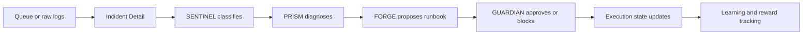
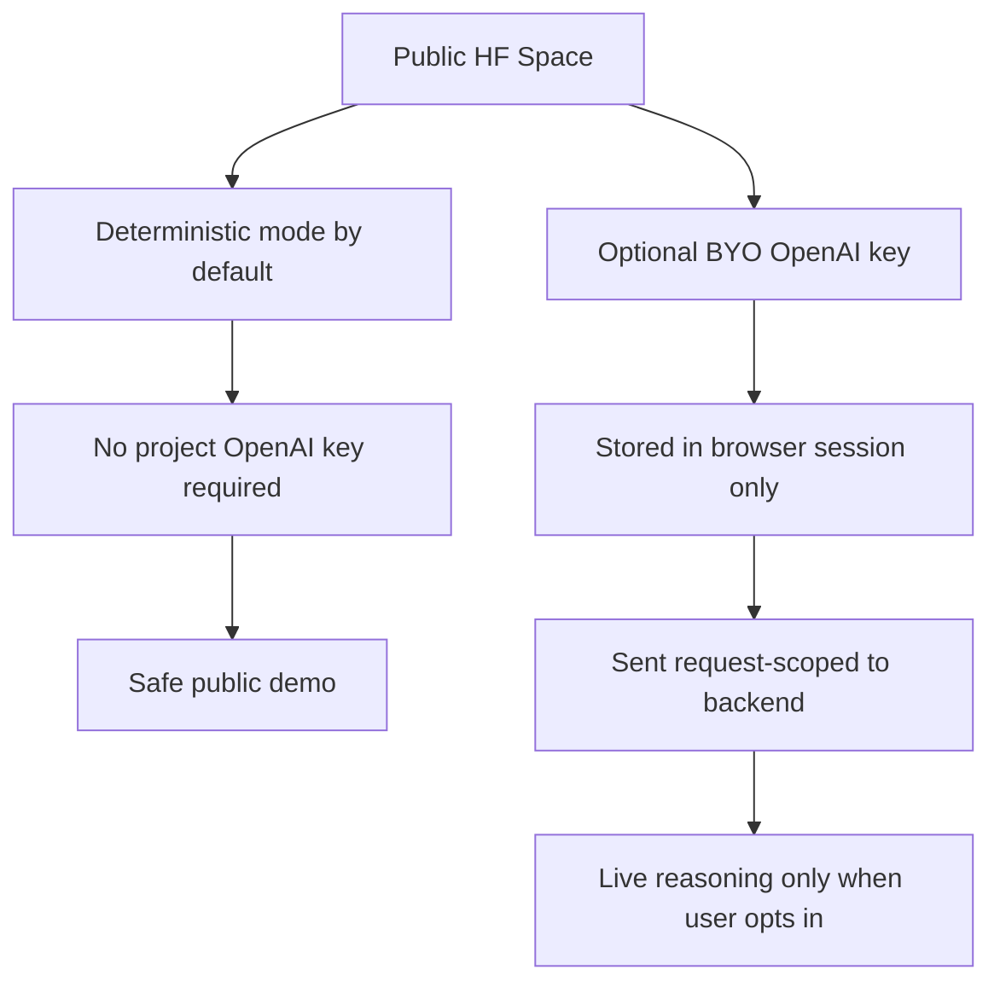

# NEXUS v2

NEXUS v2 is an agent-first incident response product prototype. It turns queue items or raw logs into a visible four-agent workflow:

`SENTINEL -> PRISM -> FORGE -> GUARDIAN`

The product is built to demonstrate three things clearly:

- incidents can move through a readable multi-agent handoff
- operators can inspect evidence, diagnosis, and governance in one place
- the public deployment can stay safe by default with optional user-supplied live reasoning

## Start Here

If you only open a few links, use these:

- Final submission guide: [docs/FINAL_SUBMISSION_GUIDE.md](docs/FINAL_SUBMISSION_GUIDE.md)
- Public app: [https://kunalkachru23-nexus.hf.space](https://kunalkachru23-nexus.hf.space)
- Hugging Face Space: [https://huggingface.co/spaces/kunalkachru23/nexus](https://huggingface.co/spaces/kunalkachru23/nexus)
- Visual diagrams and screenshots: [docs/VISUAL_ARCHITECTURE_AND_FLOWS.md](docs/VISUAL_ARCHITECTURE_AND_FLOWS.md)
- Demo cheat sheet: [docs/DEMO_CHEAT_SHEET.md](docs/DEMO_CHEAT_SHEET.md)
- Presentation pack: [docs/PRESENTATION_PACK.md](docs/PRESENTATION_PACK.md)
- Technical roadmap: [docs/TECHNICAL_ROADMAP.md](docs/TECHNICAL_ROADMAP.md)

## Product Story

NEXUS v2 focuses the user on one live incident and one clear collaboration story:

1. `SENTINEL` classifies the incident and severity.
2. `PRISM` diagnoses the likely root cause.
3. `FORGE` proposes the runbook or remediation.
4. `GUARDIAN` reviews safety and controls execution.

The UI is intentionally agent-first:

- `Command Center` keeps the active incident and queue in view
- `Incident Detail` shows the live handoff thread between agents
- `Learning & Controls` shows reward improvement and governance posture

## Core Flow



## Runtime Safety Model



## Public Deployment

Public URLs:

- App: [https://kunalkachru23-nexus.hf.space](https://kunalkachru23-nexus.hf.space)
- Space repo: [https://huggingface.co/spaces/kunalkachru23/nexus](https://huggingface.co/spaces/kunalkachru23/nexus)

Default posture:

- deterministic demo mode is on by default
- no project `OPENAI_API_KEY` is required on the public deployment
- public users cannot spend the project owner's API credits
- users can optionally attach their own OpenAI key from `Incident Detail`

## Key Docs

### Submission and demo

- [docs/FINAL_SUBMISSION_GUIDE.md](docs/FINAL_SUBMISSION_GUIDE.md)
- [docs/DEMO_CHEAT_SHEET.md](docs/DEMO_CHEAT_SHEET.md)
- [docs/DEMO_WALKTHROUGH.md](docs/DEMO_WALKTHROUGH.md)
- [docs/LIVE_DEMO_SPEAKER_NOTES.md](docs/LIVE_DEMO_SPEAKER_NOTES.md)
- [docs/PRESENTATION_PACK.md](docs/PRESENTATION_PACK.md)

### Validation and operations

- [docs/BROWSER_VERIFICATION_CHECKLIST.md](docs/BROWSER_VERIFICATION_CHECKLIST.md)
- [docs/VERIFICATION_PASS_FAIL_CHECKLIST.md](docs/VERIFICATION_PASS_FAIL_CHECKLIST.md)
- [docs/OPERATIONS.md](docs/OPERATIONS.md)

### Visuals and design

- [docs/VISUAL_ARCHITECTURE_AND_FLOWS.md](docs/VISUAL_ARCHITECTURE_AND_FLOWS.md)
- [docs/TECHNICAL_ROADMAP.md](docs/TECHNICAL_ROADMAP.md)
- [design-docs/README.md](design-docs/README.md)

## Fastest Demo Path

If you need the shortest convincing demo:

1. Open `/inputs`
2. Click `Load example logs`
3. Click `Submit raw logs`
4. Let the app redirect into the created incident
5. Show the `SENTINEL -> PRISM -> FORGE -> GUARDIAN` handoff
6. Click `Approve runbook`
7. Open `/training`
8. Show reward improvement and governance summary

## Local Run

### Docker-first

```bash
./scripts/docker_fresh.sh
```

Then open [http://127.0.0.1:7860](http://127.0.0.1:7860).

### Direct server

```bash
uvicorn server.app:app --host 0.0.0.0 --port 7860
```

### Judge demo script

```bash
python demo.py
```

## Verification

```bash
pytest tests/ -v
npm run browser:verify
python demo.py
./scripts/docker_fresh.sh
```

## Repo Map

Important implementation surfaces:

- [frontend](frontend)
- [frontend/static](frontend/static)
- [server](server)
- [training](training)
- [tests](tests)
- [scripts](scripts)

Important submission assets:

- [docs](docs)
- [docs/assets/screenshots](docs/assets/screenshots)

## Current Status

- agent-first UI: complete
- deterministic public deployment: complete
- BYO-key live reasoning path: complete
- browser validation and manual runbooks: complete
- final submission docs and diagrams: complete

## Notes For Reviewers

- GitHub `master` contains the full submission docs, diagrams, and screenshots.
- Hugging Face is intentionally kept lighter so large non-runtime assets do not affect build or load behavior.
- The public app is safe by default and does not expose or consume the project owner's OpenAI credits.
