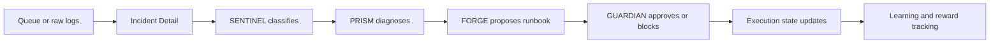
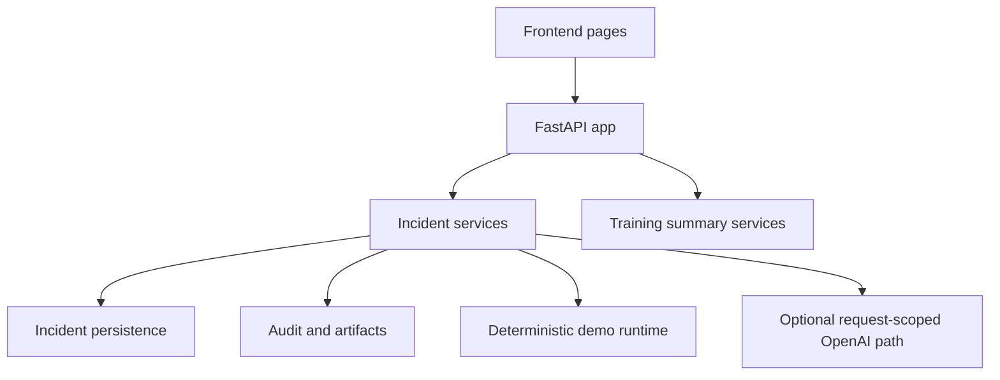

# NEXUS v2

NEXUS v2 is an autonomous incident-response product that turns queue items and raw logs into a visible four-agent workflow:

`SENTINEL -> PRISM -> FORGE -> GUARDIAN`

It is designed as a public-safe product demo for the AI Builders Hackathon: operators can inspect classification, diagnosis, remediation, and governance in one place, while the public deployment remains deterministic by default and does not consume the project owner's OpenAI credits.

## Live Demo Links

- Public app: [https://kunalkachru23-nexus.hf.space](https://kunalkachru23-nexus.hf.space)
- Hugging Face Space: [https://huggingface.co/spaces/kunalkachru23/nexus](https://huggingface.co/spaces/kunalkachru23/nexus)
- Final submission guide: [docs/FINAL_SUBMISSION_GUIDE.md](docs/FINAL_SUBMISSION_GUIDE.md)
- Visual architecture and flows: [docs/VISUAL_ARCHITECTURE_AND_FLOWS.md](docs/VISUAL_ARCHITECTURE_AND_FLOWS.md)
- Presentation pack: [docs/PRESENTATION_PACK.md](docs/PRESENTATION_PACK.md)

## Problem

Incident handling is often fragmented across alerts, queue systems, raw logs, and manual escalation paths. That creates three problems:

- triage is slow because evidence is scattered
- remediation is hard to trust because reasoning is not visible
- leadership and operators cannot easily see whether automation is safe

## Solution

NEXUS v2 addresses that with an agent-first incident workflow:

1. `SENTINEL` classifies the incident and severity.
2. `PRISM` diagnoses the likely root cause.
3. `FORGE` proposes the runbook or remediation plan.
4. `GUARDIAN` acts as the explicit governance and execution gate.

This creates a product experience that is easy to explain to judges, believable for operators, and structured enough to extend into a more production-shaped system.

## Why This Matters

- It makes autonomous incident response understandable instead of opaque.
- It gives operators one place to review evidence, reasoning, and approvals.
- It demonstrates a public deployment model that is safe by default.
- It shows how AI agents can collaborate while keeping a human-readable control surface.

## How It Works



### Primary Product Surfaces

- `Command Center`: shows the live incident queue and active agent crew
- `Incident Detail`: shows the handoff thread and governance state
- `Learning & Controls`: shows reward improvement, training progression, and governance posture

### Fastest Demo Flow

1. Open `/inputs`
2. Click `Load example logs`
3. Click `Submit raw logs`
4. Let the app redirect into the created incident
5. Show the `SENTINEL -> PRISM -> FORGE -> GUARDIAN` handoff
6. Click `Approve runbook`
7. Open `/training`
8. Show the reward curve and learning summary

## Architecture



The implementation is structured around a thin FastAPI product shell with explicit incident, training, and governance surfaces. The current codebase includes:

- a multi-page frontend in [frontend](frontend)
- a FastAPI backend in [server](server)
- training and metrics helpers in [training](training)
- browser and regression coverage in [tests](tests)

## AI Stack And Codex Usage

### Where AI is used in the product

- deterministic multi-agent incident reasoning is the default public mode
- users can optionally attach their own OpenAI key to enable live reasoning
- the live reasoning path is request-scoped and used only when the user opts in

### How OpenAI is handled safely


### How Codex and AI tooling were used

- product UI refactors and agent-first redesign
- FastAPI deployment and Hugging Face Space packaging
- browser validation and regression hardening
- deterministic and BYO-key live reasoning integration
- technical docs, diagrams, validation guides, and demo assets

## Documentation Index

### Read in this order

1. [docs/FINAL_SUBMISSION_GUIDE.md](docs/FINAL_SUBMISSION_GUIDE.md)
2. [docs/DEMO_CHEAT_SHEET.md](docs/DEMO_CHEAT_SHEET.md)
3. [docs/VISUAL_ARCHITECTURE_AND_FLOWS.md](docs/VISUAL_ARCHITECTURE_AND_FLOWS.md)
4. [docs/PRESENTATION_PACK.md](docs/PRESENTATION_PACK.md)
5. [docs/TECHNICAL_ROADMAP.md](docs/TECHNICAL_ROADMAP.md)

### Submission and demo

- [docs/FINAL_SUBMISSION_GUIDE.md](docs/FINAL_SUBMISSION_GUIDE.md)
- [docs/DEMO_CHEAT_SHEET.md](docs/DEMO_CHEAT_SHEET.md)
- [docs/DEMO_WALKTHROUGH.md](docs/DEMO_WALKTHROUGH.md)
- [docs/LIVE_DEMO_SPEAKER_NOTES.md](docs/LIVE_DEMO_SPEAKER_NOTES.md)
- [docs/PRESENTATION_PACK.md](docs/PRESENTATION_PACK.md)

### Validation and operations

- [docs/BROWSER_VERIFICATION_CHECKLIST.md](docs/BROWSER_VERIFICATION_CHECKLIST.md)
- [docs/VERIFICATION_PASS_FAIL_CHECKLIST.md](docs/VERIFICATION_PASS_FAIL_CHECKLIST.md)
- [docs/OPERATIONS.md](docs/OPERATIONS.md)

### Visuals and design

- [docs/VISUAL_ARCHITECTURE_AND_FLOWS.md](docs/VISUAL_ARCHITECTURE_AND_FLOWS.md)
- [docs/TECHNICAL_ROADMAP.md](docs/TECHNICAL_ROADMAP.md)
- [design-docs/README.md](design-docs/README.md)

## Validation

### Local run

```bash
./scripts/docker_fresh.sh
```

Then open [http://127.0.0.1:7860](http://127.0.0.1:7860).

### Direct server

```bash
uvicorn server.app:app --host 0.0.0.0 --port 7860
```

### Demo script

```bash
python demo.py
```

### Verification commands

```bash
pytest tests/ -v
npm run browser:verify
python demo.py
./scripts/docker_fresh.sh
```

## Hackathon Submission Assets

These are the mandatory assets judges will expect to see.

- Live product/demo link: [https://kunalkachru23-nexus.hf.space](https://kunalkachru23-nexus.hf.space)
- Video walkthrough: `Add final public URL before submission`
- LinkedIn/X announcement: `Add final public URL before submission`
- Architecture and technical docs: [docs/VISUAL_ARCHITECTURE_AND_FLOWS.md](docs/VISUAL_ARCHITECTURE_AND_FLOWS.md)
- Codex/OpenAI usage story: [docs/FINAL_SUBMISSION_GUIDE.md](docs/FINAL_SUBMISSION_GUIDE.md)

### Submission Checklist

- Live product link is working
- Video walkthrough link is public
- LinkedIn/X project announcement link is public
- README is polished and GitHub-renderable
- Final submission guide is current
- Visual diagrams and screenshots render correctly on GitHub
- Browser validation and demo steps are documented

## Notes For Reviewers

- GitHub `master` is the polished submission branch with full docs, diagrams, and screenshots.
- The Hugging Face deployment is intentionally lighter so non-runtime assets do not affect build and load behavior.
- The public app is safe by default and does not expose or spend the project owner's API credits.
