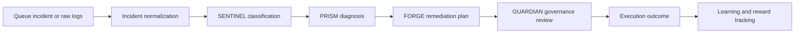
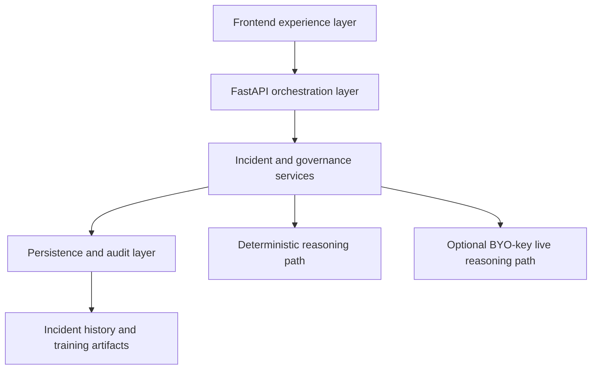

# NEXUS v2

NEXUS v2 is a multi-agent incident response product that makes autonomous operations understandable, governable, and demo-safe from the first screen.

Instead of hiding AI behind a generic chatbot or a noisy dashboard, NEXUS shows a visible team of specialist agents:

`SENTINEL -> PRISM -> FORGE -> GUARDIAN`

Each one has a job, a handoff, and an explicit place in the incident lifecycle.

## Why This Product Gets Attention

Most AI incident tools promise faster remediation, but they still fail in the same place: operators cannot clearly see what the system inferred, why it chose a response, or whether it is safe to trust in production.

NEXUS v2 is compelling because it does not just automate. It makes the automation legible.

- `SENTINEL` classifies the incident and severity.
- `PRISM` explains the likely root cause.
- `FORGE` proposes the remediation path.
- `GUARDIAN` acts as the explicit approval and safety gate.

That makes NEXUS feel less like a black box and more like a real product for modern operations teams.

## Problem

Incident response is still fragmented across alerts, logs, dashboards, runbooks, and human escalation. In practice that creates three persistent failures:

- operators lose time reconstructing context instead of resolving the issue
- remediation is hard to trust because reasoning is scattered or invisible
- engineering leaders cannot confidently explain how automation is controlled

The result is slower triage, weaker auditability, and lower trust in AI-assisted operations.

This problem is experienced most directly by SRE, platform, DevOps, and engineering teams responsible for uptime, but it also affects engineering leadership who need confidence that automation is controlled, explainable, and safe.

## Solution

NEXUS v2 turns raw logs and queue incidents into one visible incident workflow with four distinct agents and one clear governance checkpoint.

The product promise is simple:

- turn unstructured incident input into structured operational context
- show the reasoning chain from classification to diagnosis to remediation
- keep execution behind an explicit governance decision
- make learning visible without making the product feel unsafe

This is what allows the system to be both impressive in a demo and credible as a product direction.

## Before And After NEXUS

Before NEXUS:

- incidents arrive as fragmented logs, alerts, and context spread across tools
- triage depends on manual reconstruction and tribal knowledge
- remediation recommendations feel opaque
- automation trust is low because approval and safety are not clearly visible

After NEXUS:

- raw input is normalized into one incident object
- reasoning is visible from classification to diagnosis to runbook selection
- governance is explicit through `GUARDIAN`
- execution and learning both stay inspectable, auditable, and safer to trust

## Live Demo Links

- Public app: [https://kunalkachru23-nexus.hf.space](https://kunalkachru23-nexus.hf.space)
- Hugging Face Space: [https://huggingface.co/spaces/kunalkachru23/nexus](https://huggingface.co/spaces/kunalkachru23/nexus)
- Video walkthrough: [artifacts/demo-video/nexus-v2-demo.mp4](artifacts/demo-video/nexus-v2-demo.mp4)
- Final submission guide: [docs/FINAL_SUBMISSION_GUIDE.md](docs/FINAL_SUBMISSION_GUIDE.md)
- Visual architecture and flows: [docs/VISUAL_ARCHITECTURE_AND_FLOWS.md](docs/VISUAL_ARCHITECTURE_AND_FLOWS.md)

## Product Overview

NEXUS v2 is intentionally organized around three primary surfaces:

### 1. Command Center

The Command Center keeps one live incident in focus while showing the active queue and the four-agent crew. It is designed to feel like an operational control room, not a KPI wall.

### 2. Incident Detail

Incident Detail is the core product surface. This is where the operator sees the handoff thread:

- what `SENTINEL` classified
- what `PRISM` diagnosed
- what `FORGE` proposed
- what `GUARDIAN` approved, blocked, or modified

### 3. Learning & Controls

Learning & Controls explains how the system improves over time. It shows reward progression, agent accuracy, and governance posture together so the learning story never becomes disconnected from operational safety.

## How It Works



### Fastest Demo Flow

1. Open `/inputs`
2. Load example logs
3. Submit raw logs
4. Land in `Incident Detail`
5. Show the visible `SENTINEL -> PRISM -> FORGE -> GUARDIAN` handoff
6. Approve the runbook through Guardian
7. Open `/training`
8. Show the learning curve and governance posture

## Why This Is Valuable To Real Teams

NEXUS v2 is interesting as a hackathon project because it is not only technically complete; it also models a believable product category.

For operators:
- faster triage through normalized context and visible reasoning
- less guesswork around why a remediation was selected

For engineering leaders:
- clearer governance and auditability around AI-assisted actions
- a more understandable story around operational safety

For organizations adopting AI:
- deterministic default mode for safe public usage
- optional live reasoning without exposing house API keys
- a product surface that treats trust as a core feature, not post-demo cleanup

## Target Users And Workflow Impact

NEXUS is built primarily for SREs, platform engineers, incident commanders, and engineering managers running production systems.

Their pain points are consistent:

- too much time spent reconstructing context from alerts, logs, and dashboards
- inconsistent triage and unclear ownership
- low trust in AI-generated remediation suggestions
- weak auditability around approval and execution decisions

NEXUS improves that workflow by normalizing incident input into one visible agent-driven flow, making the reasoning chain explicit, keeping execution behind `GUARDIAN`, and creating a cleaner operational record that can improve over time through learning.

## Why This Is Different From A Generic AI Copilot

Most AI copilots collapse triage, diagnosis, and remediation into one assistant answer.

NEXUS does the opposite:

- it separates responsibilities across visible specialists
- it shows the handoff between reasoning stages
- it keeps governance as a first-class product feature
- it supports public-safe deployment with deterministic fallback and optional BYO-key live reasoning

That makes the system easier to understand, easier to trust, and easier to present as a serious operations product.

## Architecture And Technical Credibility



NEXUS v2 uses a deliberately simple architecture so the product remains easy to deploy, easy to explain, and safe to demonstrate publicly.

- FastAPI provides a compact backend that can serve both the product shell and the API surface cleanly.
- The multi-page frontend keeps the product experience crisp without introducing SPA complexity that would add risk to the demo.
- Deterministic-by-default reasoning makes the public product reliable and safe.
- The request-scoped BYO-key path enables live OpenAI-backed behavior only when a user explicitly opts in.
- Incident persistence, audit state, and learning artifacts support replayability and operational credibility.

For the deeper technical architecture and screenshots, see [docs/VISUAL_ARCHITECTURE_AND_FLOWS.md](docs/VISUAL_ARCHITECTURE_AND_FLOWS.md).

## Codex And OpenAI Usage

This project is also a strong demonstration of AI-assisted product building.

### What Codex enabled

- the agent-first product shell and UI refactor
- backend integration and deployment hardening
- browser-based regression validation
- demo-video automation and repo cleanup
- the final submission docs, diagrams, and validation guides

### How OpenAI is used responsibly

The public deployment is intentionally safe by default:

- no server-side project `OPENAI_API_KEY` is required for the public demo
- the product opens in deterministic demo mode
- a user may optionally attach their own key for live reasoning
- user keys stay in browser session storage and are sent request-scoped only when needed

That makes the public app safe to share without leaking or spending the project owner's API credits.

### What OpenAI powers

- optional live reasoning for users who bring their own key
- an extensibility path beyond the deterministic demo baseline
- a stronger proof point that the product can stay safe in public while still supporting real model-backed behavior

## Future Product Vision

NEXUS is designed to grow from a demo-safe incident copilot into an autonomous incident operations platform.

- today: visible triage, diagnosis, remediation, and governance
- next: deeper integrations, richer evidence, stronger policy control, and replay-backed learning
- long term: measurable operational improvement from governed AI actions taken across real incidents

The key idea is not just to assist with incidents, but to create a system that gets better at handling them while remaining understandable and controllable.

## Go-To-Market And Who Buys This

NEXUS should be positioned as `governed multi-agent incident response`, not generic AI ops.

- engineering managers want faster triage and clearer escalation paths
- platform and SRE teams want safer remediation with visible approvals
- leadership wants stronger auditability, operational trust, and a credible AI adoption story

This positioning matters because the product is not selling raw model access. It is selling trust, workflow clarity, and safer operational automation.

## Why RL Matters

The RL layer matters because it turns NEXUS into a learning system, not just a static prompt-driven assistant.

- it can learn which interventions actually work
- it can improve prioritization and runbook choice over time
- it can adapt to incident difficulty and outcome quality
- it gives the product a measurable path to getting better from real operational feedback

That makes the training surface strategically important, not just visually interesting.

## What Comes Next

The next phases after the demo are straightforward:

- stronger integrations into observability and ticketing systems
- richer evidence retrieval and correlation
- a production-grade policy engine around Guardian
- closed-loop RL from real execution outcomes
- team workflows, approvals, and incident memory
- enterprise packaging, security posture, and deployment controls

## Submission Resource Index

### Start here

1. [docs/FINAL_SUBMISSION_GUIDE.md](docs/FINAL_SUBMISSION_GUIDE.md)
2. [docs/VISUAL_ARCHITECTURE_AND_FLOWS.md](docs/VISUAL_ARCHITECTURE_AND_FLOWS.md)
3. [docs/PRODUCT_STRATEGY_AND_GTM.md](docs/PRODUCT_STRATEGY_AND_GTM.md)
4. [docs/PRESENTATION_PACK.md](docs/PRESENTATION_PACK.md)
5. [docs/TECHNICAL_ROADMAP.md](docs/TECHNICAL_ROADMAP.md)

### Core submission docs

- [docs/FINAL_SUBMISSION_GUIDE.md](docs/FINAL_SUBMISSION_GUIDE.md)
- [docs/VISUAL_ARCHITECTURE_AND_FLOWS.md](docs/VISUAL_ARCHITECTURE_AND_FLOWS.md)
- [docs/PRODUCT_STRATEGY_AND_GTM.md](docs/PRODUCT_STRATEGY_AND_GTM.md)
- [docs/PRESENTATION_PACK.md](docs/PRESENTATION_PACK.md)
- [docs/TECHNICAL_ROADMAP.md](docs/TECHNICAL_ROADMAP.md)

### Supporting demo and validation docs

- [docs/DEMO_CHEAT_SHEET.md](docs/DEMO_CHEAT_SHEET.md)
- [docs/DEMO_WALKTHROUGH.md](docs/DEMO_WALKTHROUGH.md)
- [docs/LIVE_DEMO_SPEAKER_NOTES.md](docs/LIVE_DEMO_SPEAKER_NOTES.md)
- [docs/BROWSER_VERIFICATION_CHECKLIST.md](docs/BROWSER_VERIFICATION_CHECKLIST.md)
- [docs/VERIFICATION_PASS_FAIL_CHECKLIST.md](docs/VERIFICATION_PASS_FAIL_CHECKLIST.md)
- [docs/OPERATIONS.md](docs/OPERATIONS.md)

## Validation

### Local run

```bash
./scripts/docker_fresh.sh
```

Then open [http://127.0.0.1:7860](http://127.0.0.1:7860).

### Core verification commands

```bash
pytest tests/ -v
npm run browser:verify
python demo.py
```

## Hackathon Submission Assets

- Live product/demo link: [https://kunalkachru23-nexus.hf.space](https://kunalkachru23-nexus.hf.space)
- Video walkthrough: [artifacts/demo-video/nexus-v2-demo.mp4](artifacts/demo-video/nexus-v2-demo.mp4)
- LinkedIn/X announcement: `Add final public URL before submission`
- Architecture and technical docs: [docs/VISUAL_ARCHITECTURE_AND_FLOWS.md](docs/VISUAL_ARCHITECTURE_AND_FLOWS.md)
- Codex/OpenAI usage and validation story: [docs/FINAL_SUBMISSION_GUIDE.md](docs/FINAL_SUBMISSION_GUIDE.md)

## Notes For Reviewers

- GitHub `master` is the canonical submission branch.
- The Hugging Face deployment is intentionally lighter than GitHub so non-runtime assets do not bloat the public demo environment.
- The product is designed to be impressive in a live demo without sacrificing safety or clarity.
