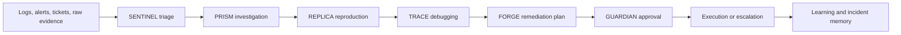
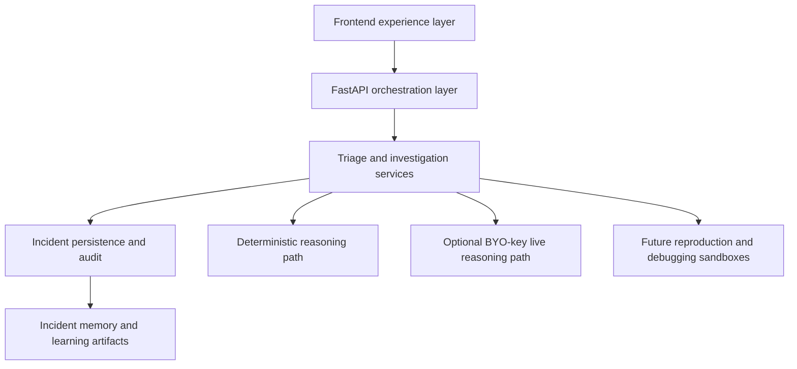

# NEXUS v2

NEXUS v2 is an AI-assisted support triage and incident investigation product designed to remove the repetitive relay work between support engineers, triage teams, and production responders.

The product vision is simple:

- noisy logs and incident evidence go in
- the system classifies, investigates, and prepares a likely remediation path
- one human reviewer steps in only when the case is already structured and action-ready

Today, the shipped product demonstrates that flow with a visible multi-agent system:

`SENTINEL -> PRISM -> FORGE -> GUARDIAN`

The broader product direction expands that into a triage, reproduction, debugging, and governed-remediation workflow.

Primary narrative and build documents:

- [Product strategy and GTM](/Users/kunalkachru/Documents/nexus-v3/docs/PRODUCT_STRATEGY_AND_GTM.md)
- [Support-triage product execution plan](/Users/kunalkachru/Documents/nexus-v3/docs/SUPPORT_TRIAGE_PRODUCT_EXECUTION_PLAN.md)
- [Final submission guide](/Users/kunalkachru/Documents/nexus-v3/docs/FINAL_SUBMISSION_GUIDE.md)

## Problem

Production support and triage teams still spend too much time doing repetitive manual work before a confident action plan exists.

In a typical incident:

- one engineer receives logs or error output
- another engineer searches for known signatures
- someone else checks dashboards and recent deploys
- evidence is pasted across team boundaries
- the issue is escalated again for reproduction or debugging
- only then does a likely remediation path emerge

That manual relay chain is slow, inconsistent, and expensive. It burns support engineering time on evidence handling instead of resolution.

## Solution

NEXUS turns that relay chain into one governed investigation workflow.

Its job is to:

- normalize raw incident evidence into a shared case
- classify the likely severity and ownership domain
- investigate likely causes with memory of prior incidents and runbooks
- prepare a remediation plan before the human reviewer is pulled in
- keep the final execution decision behind an explicit safety and approval gate

The long-term product is not “AI for incidents” in the abstract.

It is:

**a support triage and investigation system that reduces manual escalation work before final human review.**

## What Kind Of Problems NEXUS Solves

NEXUS is best suited for high-volume, high-friction support and production incidents where the first 60-80% of the work is evidence collection, issue routing, and repeated investigation.

Examples:

- checkout timeout cascades
- bad deployment regressions
- database pool exhaustion
- queue backlog and worker degradation
- certificate expiry or edge access failures
- repeated auth or dependency failures

These are strong fits because they require:

- noisy evidence handling
- likely issue matching against known history
- reproduction or environment validation
- safe remediation review before execution

## Product Vision

The end-state product combines four layers of work that today are often split across multiple engineers:

### 1. Triage

- identify likely severity
- identify likely impacted service or owner
- convert raw evidence into a structured incident

### 2. Investigation

- correlate logs, metrics, deployment changes, and prior incidents
- retrieve similar issues, known fixes, and unresolved follow-ups
- reproduce issues in production-like environments when needed
- debug likely code paths when the problem is not obvious from symptoms alone

### 3. Action Preparation

- propose the safest runbook or remediation path
- explain why that path was selected
- attach rollback and risk context

### 4. Governance

- require one clear human approval point
- keep execution auditable
- preserve operator trust and policy control

## Current Shipped Workflow

Today, the product visibly demonstrates the first version of that vision with four shipped agents:

- `SENTINEL` classifies the incident and frames the case
- `PRISM` investigates likely root cause from evidence and history
- `FORGE` prepares the runbook or remediation path
- `GUARDIAN` acts as the approval and safety gate

## Target Product Workflow

The fuller product direction expands the current workflow into:



Meaning:

- `SENTINEL` decides what kind of case this is
- `PRISM` identifies the most likely issue and known patterns
- `REPLICA` reproduces the failure in a production-like environment when reproduction is needed
- `TRACE` investigates the likely code path and debugging state when the issue needs code-level analysis
- `FORGE` prepares the safest action plan
- `GUARDIAN` keeps one final human control point

`REPLICA` and `TRACE` are product-direction agents, not fully shipped agents yet.

## Why This Product Matters

The main value is not “more AI.”

The main value is:

- fewer manual handoffs
- less repetitive log pasting and issue matching
- faster time to confident triage
- fewer unnecessary escalations
- better reuse of prior incident knowledge
- safer remediation decisions

For enterprises, this means support engineers and incident responders spend less time assembling the case and more time resolving it.

## Who Buys This

NEXUS is aimed at organizations that operate support engineering, triage, NOC, SRE, or platform response teams.

The strongest buyers are teams that already have:

- repeated production incidents
- expensive multi-level escalation workflows
- too much manual evidence gathering
- poor reuse of known issue history
- a need for safe human approval before remediation

## How The Product Should Be Demonstrated

The strongest demo is not “AI agents talking.”

It is:

1. raw logs arrive from a real production-style issue
2. the system turns them into a structured case
3. the likely issue and prior history are surfaced
4. a remediation plan is prepared
5. one human reviews and approves the action

The best flagship use case is a customer-facing outage such as:

- checkout timeout cascade after dependency degradation and retry amplification
- deployment regression causing 500s
- queue backlog after worker failure

That shows the product solving a painful, buyable workflow.

## Live Demo Links

- Public app: [https://kunalkachru23-nexus.hf.space](https://kunalkachru23-nexus.hf.space)
- Hugging Face Space: [https://huggingface.co/spaces/kunalkachru23/nexus](https://huggingface.co/spaces/kunalkachru23/nexus)
- Submission walkthrough video: [artifacts/demo-video/nexus-v2-submission-walkthrough.mp4](artifacts/demo-video/nexus-v2-submission-walkthrough.mp4)
- Product demo video: [artifacts/demo-video/nexus-v2-demo.mp4](artifacts/demo-video/nexus-v2-demo.mp4)

## Live Reasoning And Keys

NEXUS stays deterministic by default.

- local or hosted users can optionally provide `OPENAI_API_KEY`-backed live reasoning through the request-scoped BYO-key flow
- if no key is attached, the product remains fully usable in deterministic mode
- the public contract does not require a server-side key to keep the product operable

## Product Surfaces

### Command Center

The Command Center keeps one live case in focus while showing the active queue and crew state.

### Incident Detail

Incident Detail is the main product surface. It shows the handoff from triage to investigation to runbook to governance.

### Learning & Controls

Learning & Controls explains how the system measures runtime quality, remembers prior incidents, and improves over time.

## Why This Is Different

Most AI incident products stop at:

- summarizing logs
- proposing a generic answer
- leaving humans to manually investigate the rest

NEXUS is different because it is built around the support triage relay chain itself.

The product is designed to collapse repetitive manual steps:

- evidence gathering
- issue matching
- reproduction setup
- debugging context preparation
- remediation drafting

into one coordinated workflow before human approval.

## Architecture And Technical Direction



Current architecture priorities:

- safe public deployment
- deterministic fallback
- request-scoped BYO-key live reasoning
- visible handoff between stages
- auditability and replayability

Target architecture additions:

- reproduction environments for issue recreation
- debugging sandboxes for code-path tracing
- richer memory and RAG across incident history
- tool access into observability, deployment, and ticketing systems

## Codex And OpenAI Usage

Codex helped across:

- product shell design and refactoring
- backend orchestration and validation
- browser-based test coverage
- docs, demo packaging, and deploy hardening

OpenAI usage is intentionally safe:

- the public deployment defaults to deterministic mode
- no server-side project key is required for the public demo
- users can optionally attach their own key for live reasoning
- keys stay request-scoped and browser-session local

## Product Strategy Docs

- [docs/FINAL_SUBMISSION_GUIDE.md](docs/FINAL_SUBMISSION_GUIDE.md)
- [docs/VISUAL_ARCHITECTURE_AND_FLOWS.md](docs/VISUAL_ARCHITECTURE_AND_FLOWS.md)
- [docs/PRODUCT_STRATEGY_AND_GTM.md](docs/PRODUCT_STRATEGY_AND_GTM.md)
- [docs/PRESENTATION_PACK.md](docs/PRESENTATION_PACK.md)
- [docs/TECHNICAL_ROADMAP.md](docs/TECHNICAL_ROADMAP.md)

## Validation

### Local run

```bash
./scripts/docker_fresh.sh
```

Then open [http://127.0.0.1:7860](http://127.0.0.1:7860).

### Core verification commands

```bash
pytest tests/ -v
npm run browser:verify
python demo.py
```

## Notes

- GitHub `master` remains the canonical submission branch.
- The Hugging Face deployment stays lighter than GitHub so runtime artifacts do not bloat the public demo environment.
- The current shipped demo proves the triage -> investigation -> remediation -> governance loop.
- Reproduction and debugging agents are the next major product expansion, not a shipped claim today.
