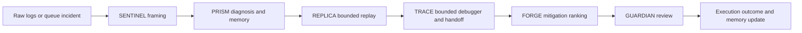
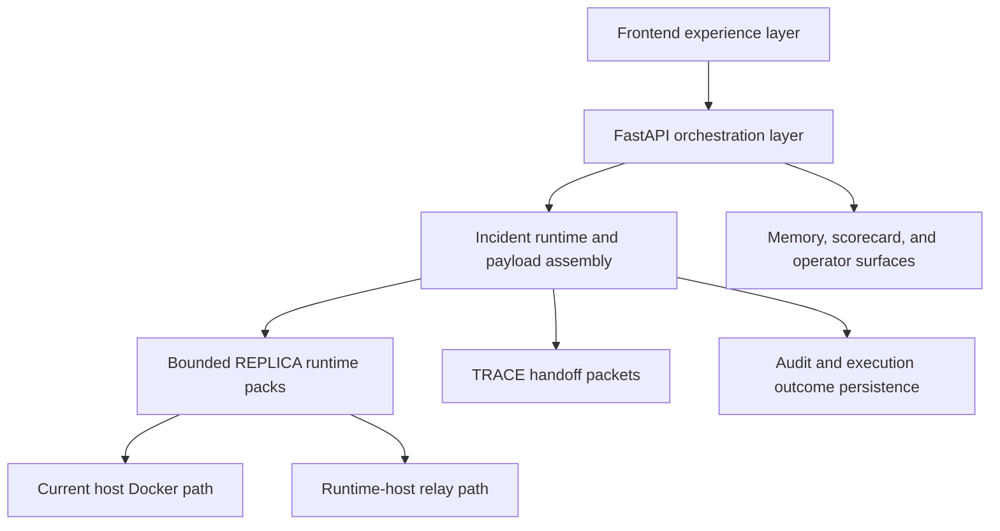

# NEXUS Visual Architecture And Flows

Current as of 2026-06-15.

This document explains what the product shows on screen and how the current bounded workflow operates.

## Product Screenshots

### Command Center

### Incident Detail

### Raw Log To Incident Flow

### Learning & Controls

## What The Product Must Answer

Every major surface should help the operator answer:

1. what is most likely happening?
2. who likely owns it?
3. what prior cases matter?
4. what is supported versus bounded?
5. what should happen next?
6. who approves the action?

## Current Workflow

This is the shipped bounded workflow, not just a target state.

## Why The Architecture Works

- intake becomes a structured case quickly
- diagnosis is visible instead of opaque
- replay posture is explicit
- debugging guidance is attached to the incident
- approval is part of the product, not a side conversation

## System Shape

## Screen Roles

### Command Center

- shows the live incident queue
- establishes the current operator focus
- introduces the specialist crew

### Inputs

- accepts noisy raw evidence
- shows intake quality and normalization posture
- creates the first structured case

### Incident Detail

- is the main support-to-engineering investigation surface
- shows the incident story, task board, replay posture, debugging cues, and Guardian gate

### Learning & Controls

- connects the latest incident to health, scorecard, and value proof
- keeps runtime, governance, and pilot posture visible

## Bounded Layers

### REPLICA

REPLICA is:

- a bounded replay system for curated packs
- capable of comparing baseline and mitigation outcomes when runtime is available

REPLICA is not:

- arbitrary VM orchestration
- universal reproduction across all stacks

### TRACE

TRACE is:

- a bounded developer handoff and debugger guidance layer
- capable of pointing engineers to likely modules, functions, and checkpoints for curated families

TRACE is not:

- a universal live debugger
- arbitrary codebase introspection across unknown systems
