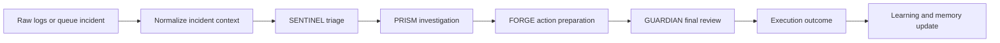
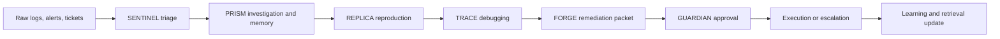
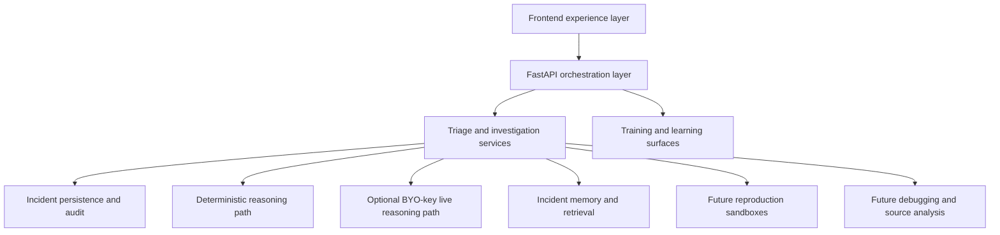
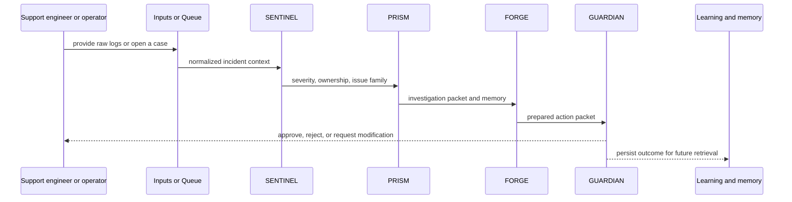

# NEXUS v2 Visual Architecture And Flows

Current as of 2026-06-05.

This document explains what the product looks like, how the current shipped workflow works, and how the architecture expands into reproduction and debugging.

## Product Screenshots

### Command Center

### Incident Detail

### Raw Log To Incident Flow

### Learning & Controls

## What The Product Is Designed To Show

NEXUS is not a generic AI-for-incidents surface.

It is a support triage and incident investigation product designed to reduce manual relay work before one final human review point.

The product should answer these questions on screen:

1. what is most likely happening?
2. who likely owns the issue?
3. what prior cases matter?
4. what should happen next?
5. who approves it?

## Current Shipped Product Flow

### Why this flow matters

- intake becomes one structured case
- investigation becomes visible
- action preparation becomes explicit
- governance becomes a product feature rather than a hidden rule

## Target Product Flow

This is the full product direction:

- triage
- investigation
- reproduction
- debugging
- remediation
- governance

## Why The Architecture Is Shaped This Way

### Why FastAPI

- compact backend
- serves both HTML and JSON contracts
- easy single-container public deployment

### Why a multi-page frontend

- easier to reason about screen by screen
- easier to demo and validate route by route
- lower failure surface than a full SPA rewrite

### Why deterministic-by-default

- safe public demo
- reproducible judging flow
- live reasoning remains optional, not required

### Why visible agent roles

- the product needs to show work, not just answer
- support organizations care about traceability and trust

## System Architecture

## Architecture Layers

### Frontend experience layer

The user-facing surfaces:

- `Command Center`
- `Inputs`
- `Incident Detail`
- `Training`
- `History`
- `Replay`

Their job is to present one coherent support-triage product, not backend fragments.

### Orchestration layer

This layer:

- receives normalized incident requests
- serves the queue and incident surfaces
- coordinates the visible agent flow
- handles Guardian review actions

### Persistence and audit layer

This layer stores:

- incident records
- audit history
- execution outcomes
- retrieval and learning artifacts

### Memory layer

This layer is already visible in the product through:

- similar incidents
- runbook memories
- unresolved follow-ups

It becomes even more important as the product moves toward support-triage specialization.

### Future reproduction layer

This is the `REPLICA` direction.

Its job is to:

- recreate likely failure conditions
- validate or reject hypotheses
- test likely mitigations in a controlled environment

### Future debugging layer

This is the `TRACE` direction.

Its job is to:

- narrow likely code paths
- identify state or control-flow anomalies
- prepare developer-ready debugging context

## End-To-End Data Flow

## Agent Design

### SENTINEL

- job: triage the incident and frame the case
- output: severity, likely service, likely team, issue family, confidence

### PRISM

- job: investigate likely cause and historical context
- output: root-cause hypothesis, evidence summary, deploy analysis, memory hits

### FORGE

- job: prepare the remediation path
- output: proposed action, alternatives, rollback context, rationale

### GUARDIAN

- job: govern the final review point
- output: approve, reject, or request modification with policy posture

### REPLICA

- product-direction job: reproduce the issue in a production-like environment
- output: reproduction result, validation notes, confidence shift

### TRACE

- product-direction job: narrow likely code path and debugging state
- output: suspected modules, divergence summary, debugging notes

## What Makes This Production-Shaped

Even in its current shipped form, NEXUS already has:

- explicit human review before action
- deterministic fallback for public stability
- visible memory and history
- auditable decisions
- a credible path from triage into deeper investigation

That is what makes it feel closer to a real product than a generic model wrapper.
