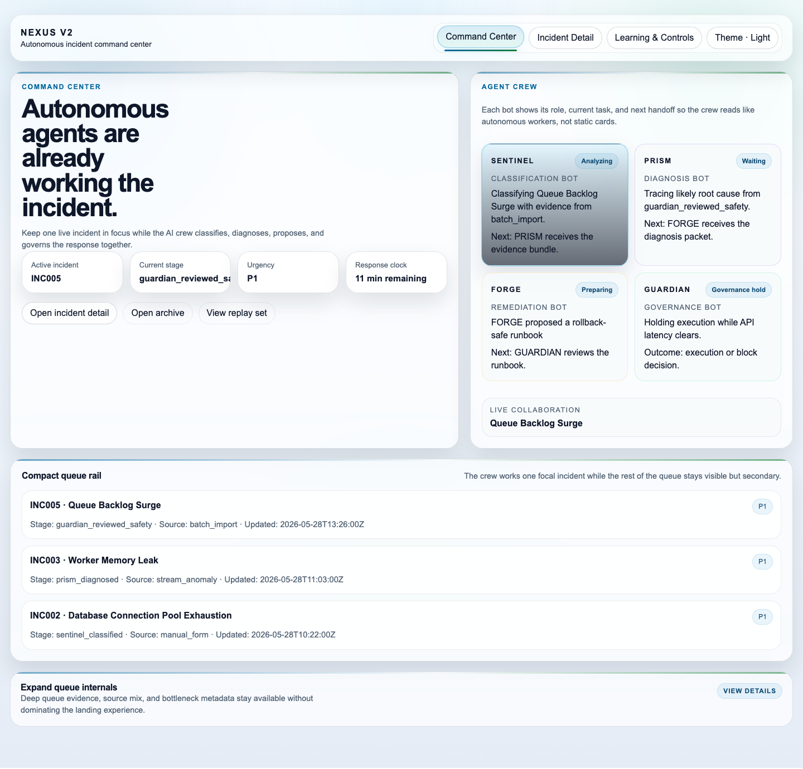
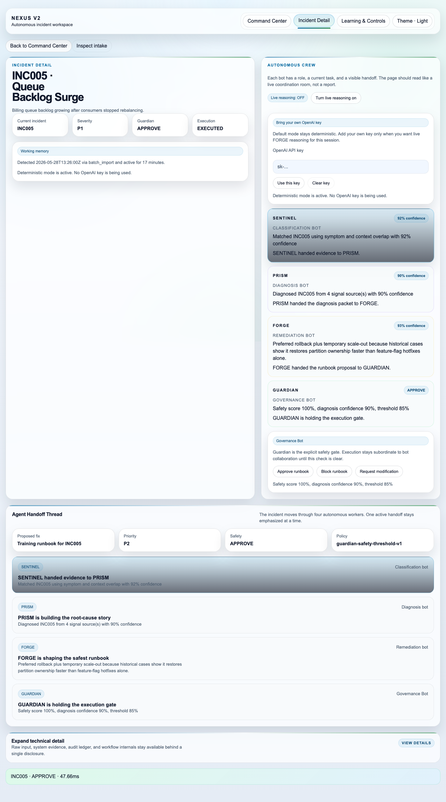
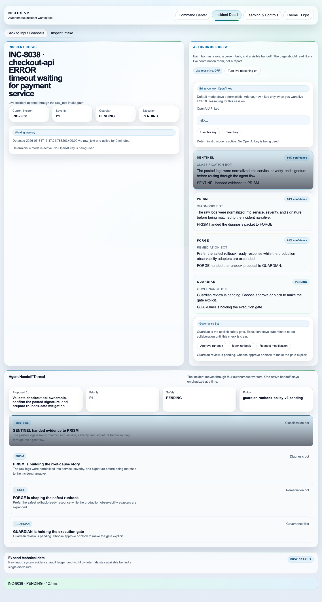
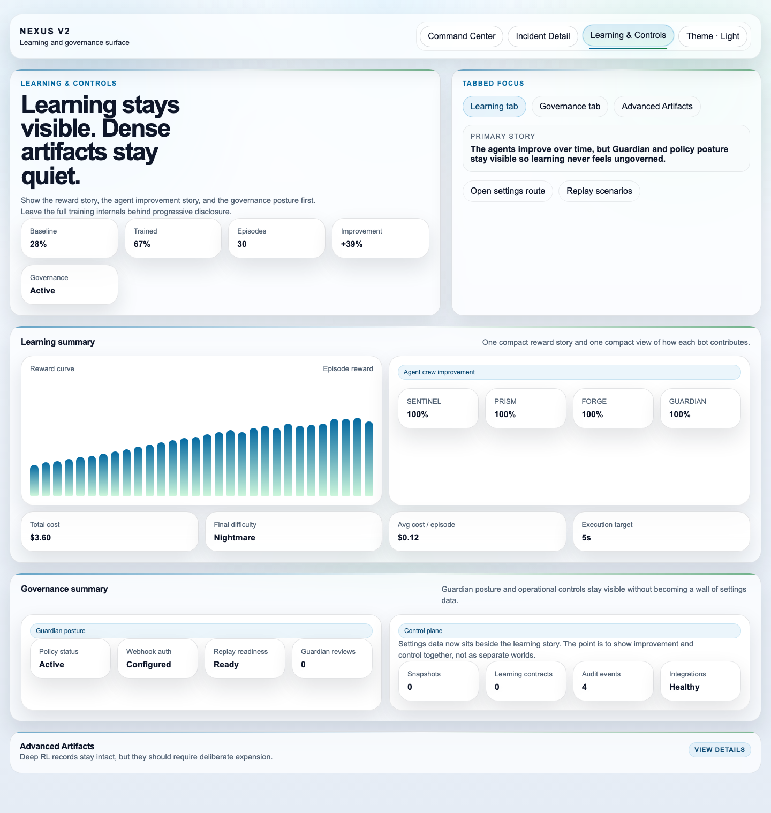
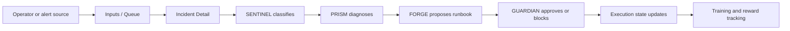
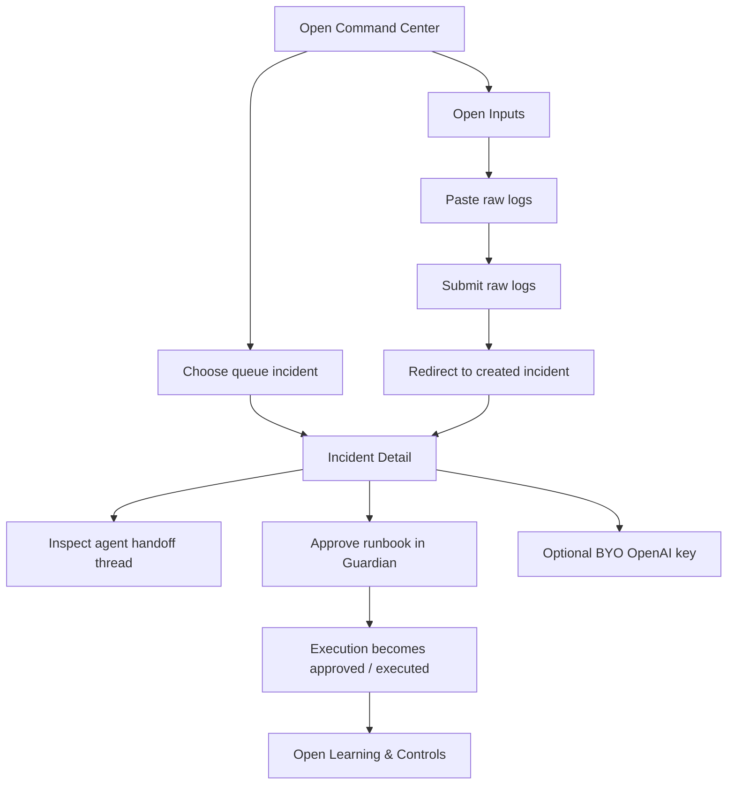
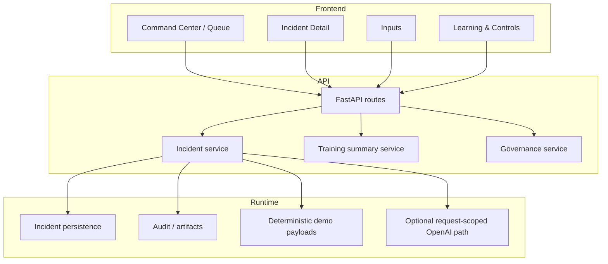
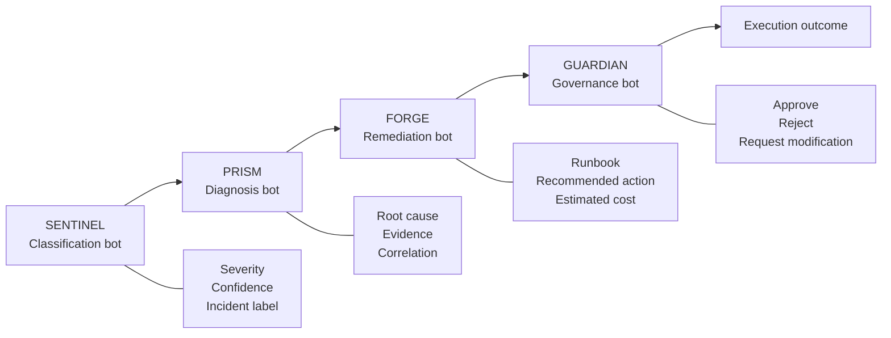
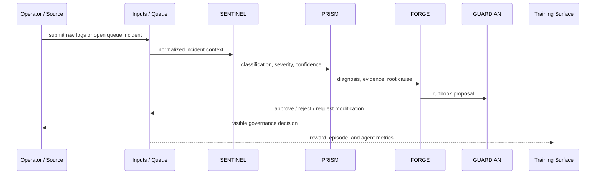
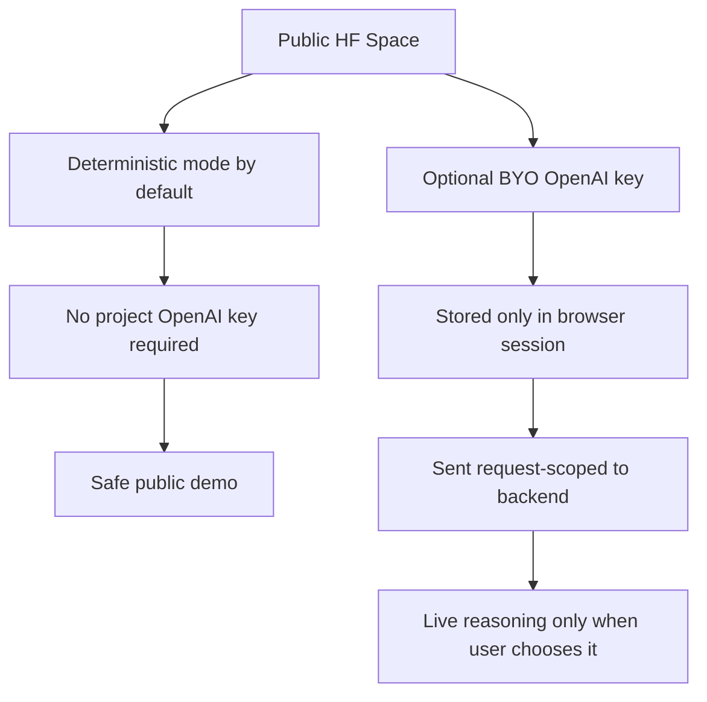

# NEXUS v2 Visual Architecture And Flows

Current as of 2026-05-31.

This document collects the core visual assets for final submission:

- product screenshots
- user-flow diagrams
- technical architecture diagrams
- agent collaboration design
- incident classification and resolution flow

## Product Screenshots

### Command Center

### Incident Detail

### Raw Log To Incident Flow

### Learning & Controls

## High-Level Product Flow

## User Journey Flow

## Frontend / Backend Surface Design

## Agent Collaboration Design

## Classification And Incident Resolution Flow

## Runtime Mode Design

## Agent Design Summary

### SENTINEL

- role: classify incident and severity
- output: incident label, severity, confidence, reasoning
- visible in UI as the first handoff

### PRISM

- role: diagnose likely root cause
- output: diagnosis, evidence, correlation reasoning
- visible in UI as the second handoff

### FORGE

- role: generate remediation or runbook proposal
- output: runbook summary, candidate action, cost
- visible in UI as the third handoff

### GUARDIAN

- role: review safety and control execution
- output: approve, reject, or request modification
- visible in UI as the final explicit governance gate

## Why These Visuals Matter

These visuals support the final submission story clearly:

- the screenshots prove the product exists and is coherent
- the diagrams explain how the user moves through it
- the agent diagrams explain how the system collaborates
- the runtime-mode diagram explains why the public deployment is safe
