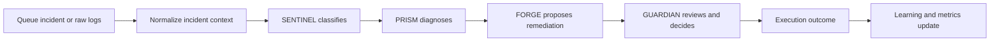
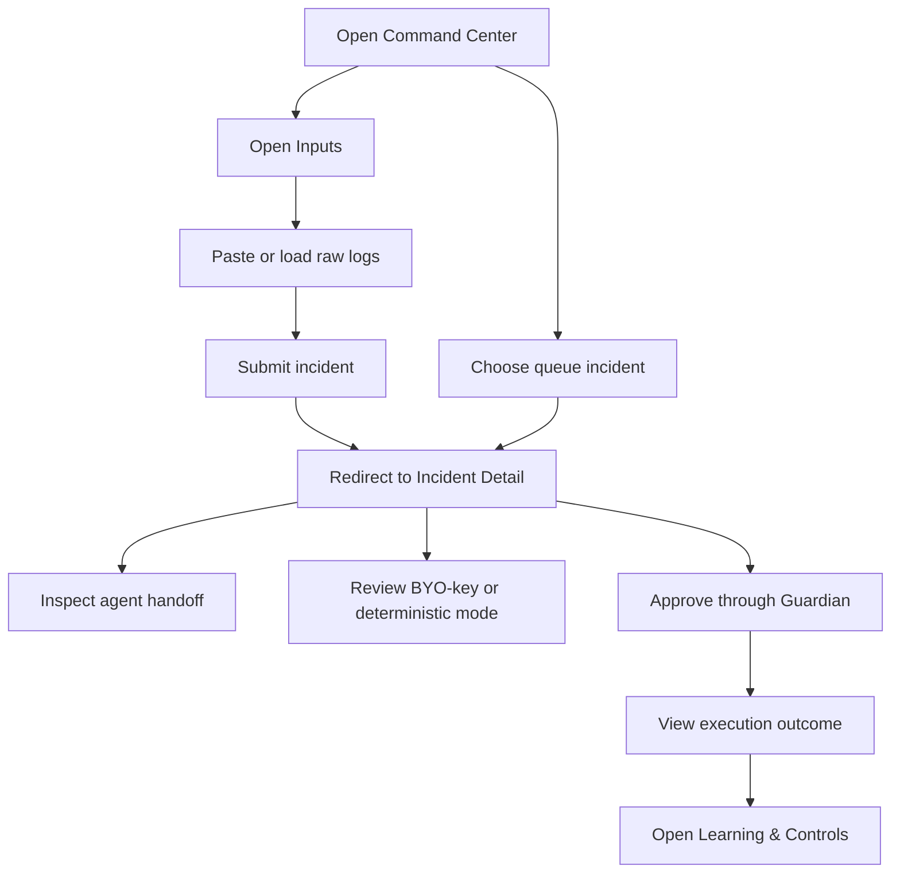
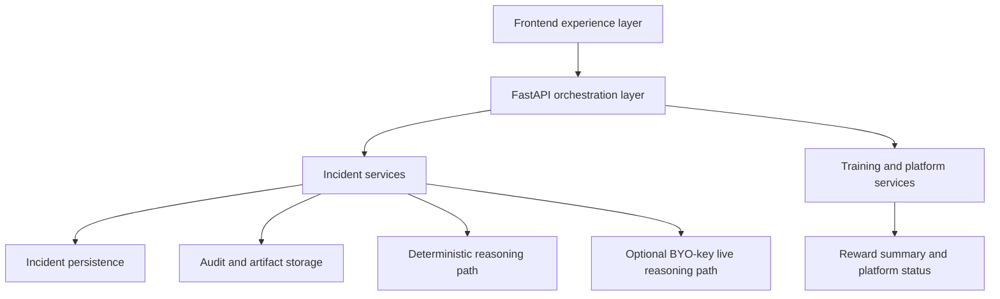
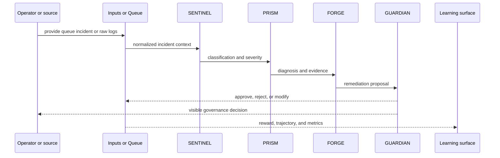
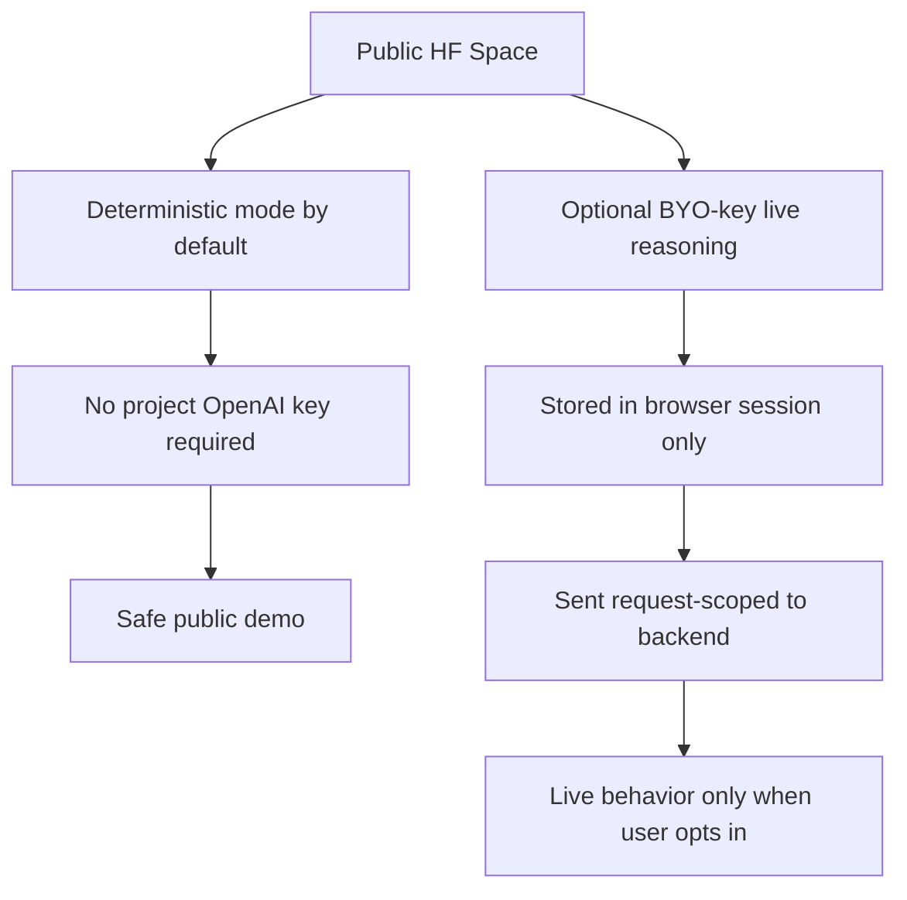

# NEXUS v2 Visual Architecture And Flows

Current as of 2026-05-31.

This document is the technical and visual companion to the root README. It is meant to do three things well:

- show what the product looks like
- explain how the product works
- explain why the architecture is credible for a public AI demo

## Product Screenshots

### Command Center

### Incident Detail

### Raw Log To Incident Flow

### Learning & Controls

## What The Product Is Designed To Show

NEXUS v2 is not a generic “AI for incidents” demo. It is specifically designed to show visible multi-agent reasoning with governance.

The product experience answers four questions on screen:

1. What happened?
2. What does the system think is wrong?
3. What should happen next?
4. Who authorizes execution?

That is why the product is structured around `SENTINEL`, `PRISM`, `FORGE`, and `GUARDIAN` rather than one monolithic assistant.

## Product Flow

### Why this flow matters

- intake becomes structured context instead of staying opaque
- reasoning is visible stage by stage
- governance is explicit instead of hidden behind automation
- learning is tied back to the same operational workflow

## User Journey

## Why The Architecture Is Shaped This Way

NEXUS v2 uses a deliberately conservative architecture for a good reason: the product has to be impressive in public and stable under live demo conditions.

### Why FastAPI

- it keeps the backend compact and predictable
- it cleanly serves both HTML surfaces and JSON contracts
- it reduces operational overhead for a single-container public deployment

### Why a multi-page frontend

- the product is easier to reason about screen by screen
- direct route links help manual demo and judging flows
- it avoids SPA complexity that would add failure points without improving the submission

### Why deterministic-by-default runtime

- public users should not be able to burn the project owner’s API credits
- the main demo should remain reproducible
- the product needs a stable fallback even without live model access

### Why BYO-key live reasoning

- it preserves a live OpenAI-backed path for users who want it
- it keeps the public app safe by default
- it turns API-key handling into an explicit product choice rather than a hidden infrastructure detail

## System Architecture

## Architecture Layers

### 1. Frontend experience layer

This is the product shell users interact with:

- `Command Center`
- `Incident Detail`
- `Inputs`
- `Learning & Controls`

Its job is to present the system as a coherent operational product, not as raw backend output.

### 2. Orchestration and API layer

This layer:

- receives normalized incident requests
- serves queue and incident surfaces
- handles Guardian review actions
- exposes training and platform status

Its job is to keep the incident workflow explicit and testable.

### 3. Incident persistence and audit layer

This layer stores:

- incident records
- audit history
- execution outcomes
- learning and replay artifacts

Its job is to make the workflow replayable, inspectable, and more production-shaped.

### 4. Optional live reasoning path

This path is only used when a user explicitly supplies their own OpenAI key. It exists to show extensibility without making the public demo unsafe.

## End-To-End Data Flow

## Request Lifecycle

In concrete terms, one incident moves through the system like this:

1. input arrives from queue selection or raw logs
2. the backend normalizes it into one incident context
3. `SENTINEL` classifies severity and category
4. `PRISM` explains the likely cause from available evidence
5. `FORGE` proposes the runbook or remediation path
6. `GUARDIAN` authorizes, blocks, or modifies execution
7. the result is persisted for auditability, replay, and learning

This lifecycle matters because it makes the AI behavior explicit at every step rather than compressing everything into one opaque answer.

## Agent Design

The four-agent split is a product decision as much as an architecture decision.

### SENTINEL

- job: classify incident type and severity
- input: normalized incident context
- output: incident label, priority, confidence, reasoning
- why it matters: it gives the workflow a clear first interpretation step

### PRISM

- job: diagnose likely root cause
- input: classified incident plus evidence bundle
- output: diagnosis, supporting evidence, correlation narrative
- why it matters: it separates interpretation from remediation

### FORGE

- job: propose the remediation or runbook
- input: diagnosis and operational context
- output: runbook proposal, candidate action, rationale
- why it matters: it makes the “what should we do” step explicit

### GUARDIAN

- job: govern execution
- input: runbook proposal plus policy posture
- output: approve, reject, or request modification
- why it matters: it turns safety into a visible product feature

## What Makes This Production-Shaped

Even as a hackathon demo, NEXUS v2 includes several traits that make it feel closer to a real product than a mockup:

- explicit governance gate before execution
- deterministic fallback for stable public use
- replayability through consistent incident artifacts
- auditability through visible status and review flows
- public-safe deployment posture through BYO-key live reasoning

## Failure Containment And Fallback

NEXUS is intentionally designed so that demo quality does not depend on always-available live model access.

- deterministic reasoning remains the default runtime path
- the public product does not require a server-side `OPENAI_API_KEY`
- live behavior is additive and opt-in, not a dependency for the main experience
- governance remains visible even when live reasoning is not enabled

This is important for both reliability and trust: the product still works, still explains itself, and still feels coherent even when live model access is absent.

## Runtime Safety Design

## Why This Technical Story Matters

This architecture supports the core pitch of NEXUS v2:

- visible AI reasoning
- explicit governance
- credible operational workflow
- safe public deployment

That combination is what makes the project feel stronger than a UI demo or a model wrapper. It behaves like a product with a clear point of view.
