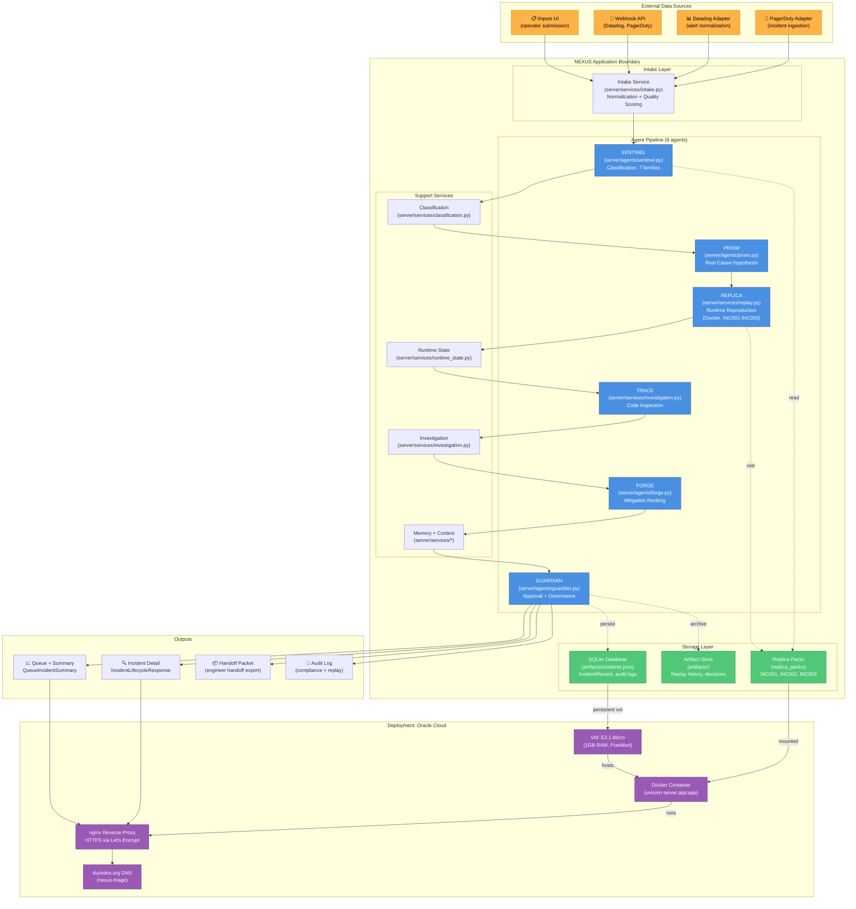

# System Overview

High-level architecture showing external inputs, NEXUS boundary, the 6-agent pipeline, storage, and deployment context.

## Architecture Diagram

## Component Roles

### Intake Layer
- **Purpose:** Normalize diverse input formats (webhooks, raw text, manual forms) into unified `NormalizedEvidence`
- **Input:** Raw incident data from any source (Datadog, PagerDuty, /inputs UI, Slack)
- **Output:** `NormalizedEvidence` dict + quality metrics
- **Location:** `server/services/intake.py`

### Agent Pipeline

**SENTINEL** (Classification)
- Matches symptoms and context against 7-family catalogue
- Returns: `SentinelClassification(incident_id, severity, confidence, reasoning)`
- Pattern-based (deterministic) or LLM-based (if client provided)

**PRISM** (Diagnosis)
- Generates root cause hypothesis from classification context
- Stub implementation (returns structured reasoning)
- Returns: hypothesis + confidence

**REPLICA** (Reproduction)
- Runtime reproducer for INC001, INC002, INC003 only
- Delegates to Docker runtime-host via REST
- Returns: runtime outcomes or "not reproducible" for other families
- Uses: `server/services/replay.py`

**TRACE** (Debugging)
- Code inspection and debugging guidance
- Bounded to curated packs only
- Returns: code locations, inspection points, remediation paths
- Uses: `server/services/investigation.py`

**FORGE** (Mitigation)
- Ranks mitigations using: runtime outcomes (if available) + inference + memory
- Scores each option with confidence and risk
- Returns: ranked mitigation list + evidence posture
- Uses: `server/agents/forge.py`

**GUARDIAN** (Approval)
- Human approval gate with governance policy enforcement
- Records decision, reasoning, and execution context
- Transitions case to "awaiting_action" only if approved
- Uses: `server/agents/guardian.py`

### Storage

**SQLite Database** (`artifacts/incidents.json`)
- Persists: `IncidentRecord`, audit logs, decision history
- Tenant-isolated schema
- Durable across container restarts

**Replica Packs** (`replica_packs/`)
- Docker Compose definitions for INC001, INC002, INC003
- Mounted into runtime-host container
- Enable REPLICA to reproduce in isolated environments

**Artifact Store** (`artifacts/`)
- Replay execution history
- Guardian decisions and reasoning
- Memory/context snapshots for pilot use

### Deployment on Oracle Cloud

**Infrastructure:**
- **VM:** E2.1.Micro (1GB RAM, single vCPU, Frankfurt region)
- **SSH:** `ssh -i ~/Downloads/ssh-key-2026-06-19.key ubuntu@92.5.47.239`

**Layers:**
1. **nginx** — Reverse proxy, SSL termination (Let's Encrypt), HTTPS → HTTP routing
2. **Docker Container** — uvicorn FastAPI server on port 7860
3. **Named Volume** — `nexus-data` → `/app/artifacts` (incident data persistence)
4. **DNS** — duckdns.org dynamic DNS (`nexus-triage.duckdns.org`)

**Automatic deployment:** GitHub Actions triggers on `git push origin master`
- Run tests (495 pytest + 16 browser tests)
- Deploy Docker image to Oracle Cloud
- Run smoke tests against production

---

## Key Design Points

1. **Single Responsibility:** Each agent has one clear input/output contract
2. **Evidence Postures:** 🟢 runtime-backed, 🟡 inference-first, 🔴 unsupported
3. **Bounded Scope:** Only 7 families with full payloads; 4 catalogued but not wired
4. **Deterministic Intake:** No LLM required for normalization (improves consistency)
5. **Human Gate:** Guardian approval required before any action
6. **Durable Storage:** Incident data persists across restarts; audit logs preserved
7. **Isolated Reproduction:** REPLICA runs in separate Docker container, not host system
