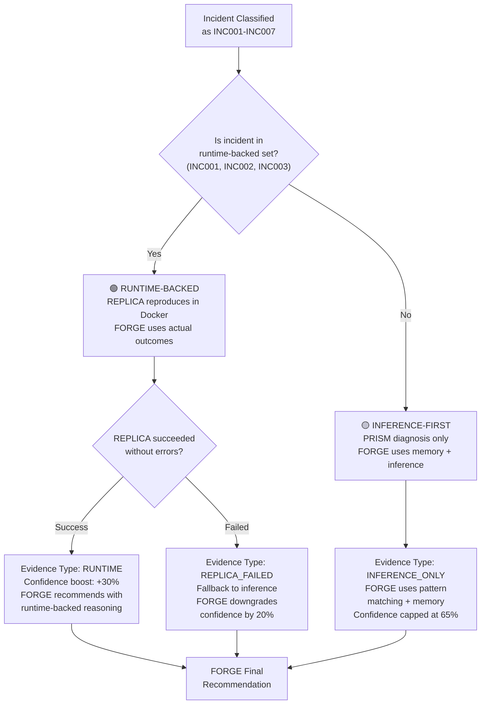

# Agent Pipeline

Detailed view of the 6-agent handoff flow and evidence posture decision logic.

## Agent Handoff Flow

```mermaid
flowchart LR
    RAW["📝 Raw Incident Text<br/>(operator input)"]
    
    subgraph INTAKE["Intake Normalization"]
        INT["build_raw_text_normalized_evidence()<br/>↓<br/>Severity detection<br/>Service extraction<br/>Quality scoring"]
    end
    
    subgraph SENTINEL["SENTINEL — Classification"]
        S1["load_incident_types()"]
        S2["Match symptoms + context<br/>vs. 7-family catalogue"]
        S3["Score each family<br/>Return: incident_id + confidence"]
        S1 --> S2 --> S3
    end
    
    subgraph PRISM["PRISM — Diagnosis"]
        P1["Classification context<br/>(incident_id, symptoms)"]
        P2["Generate root cause<br/>hypothesis + confidence"]
        P1 --> P2
    end
    
    subgraph REPLICA["REPLICA — Reproduction"]
        R1["Check: Is incident<br/>in runtime-backed set?<br/>(INC001, INC002, INC003)"]
        R2A["Yes: Delegate to<br/>Docker runtime-host<br/>via REST API"]
        R2B["No: Return<br/>SCAFFOLD_ONLY posture"]
        R1 --> R2A
        R1 --> R2B
    end
    
    subgraph TRACE["TRACE — Debugging"]
        T1["Runtime outcomes or<br/>diagnosis available?"]
        T2A["Yes: Generate code<br/>inspection points<br/>+ remediation paths"]
        T2B["No: Fallback to<br/>pattern-based guidance"]
        T1 --> T2A
        T1 --> T2B
    end
    
    subgraph FORGE["FORGE — Mitigation"]
        F1["Collect evidence:<br/>Runtime + Inference + Memory"]
        F2["Rank mitigations<br/>by feasibility + impact"]
        F3["Score confidence<br/>per evidence posture"]
        F1 --> F2 --> F3
    end
    
    subgraph GUARDIAN["GUARDIAN — Approval"]
        G1["Check governance<br/>policy + risk scoring"]
        G2["Operator decision:<br/>Approve / Reject"]
        G1 --> G2
    end
    
    subgraph OUTPUT["Outputs"]
        OUT1["✅ Approved: Queue item<br/>+ Handoff packet"]
        OUT2["❌ Rejected: Case<br/>+ reasoning"]
    end
    
    RAW --> INT
    INT --> SENTINEL
    SENTINEL --> PRISM
    PRISM --> REPLICA
    REPLICA --> TRACE
    TRACE --> FORGE
    FORGE --> GUARDIAN
    GUARDIAN --> OUTPUT
```



## Evidence Posture Decision Tree



## Agent Details

### SENTINEL — Classification

**Input:**
- `raw_symptoms: list[str]` — Symptoms from operator or normalized evidence
- `system_context: SystemContext` — service, language, infra, dependencies

**Processing:**
- Loads 11-family incident catalogue via `load_incident_types()`
- Scores each family using keyword matching + symptom overlap
- Returns best match + confidence

**Output:**
```python
SentinelClassification(
    incident_id="INC001",      # One of 7 supported families
    incident_name="API Timeout Cascade",
    severity="P2",
    confidence=0.92,           # 0.0-1.0
    reasoning="Matched via symptom overlap..."
)
```

**Implementation:** `server/agents/sentinel.py`  
**Status:** ✅ Fully implemented

---

### PRISM — Diagnosis

**Input:**
- Classification from SENTINEL
- System context and normalized evidence

**Processing:**
- Generates root cause hypothesis grounded in classification
- Uses LLM (if client provided) or pattern-based reasoning
- Scores confidence in hypothesis

**Output:**
```python
PrismDiagnosis(
    hypothesis="Retry storm exhausted worker threads",
    confidence=0.85,
    affected_services=["api-gateway", "auth-svc"],
    likely_root_cause="Downstream timeout on auth calls"
)
```

**Implementation:** `server/agents/prism.py`  
**Status:** ✅ Fully implemented

---

### REPLICA — Reproduction

**Input:**
- Incident ID (from SENTINEL)
- Docker environment flag (`ENABLE_RUNTIME_HOST_RELAY`)

**Processing:**
- Checks if incident is in `{INC001, INC002, INC003}`
- If yes: Delegates to Docker runtime-host via REST
- If no: Returns SCAFFOLD_ONLY posture

**Output:**
```python
ReplayOutcome(
    incident_id="INC001",
    posture="RUNTIME_BACKED",        # or SCAFFOLD_ONLY
    runtime_host="docker-runtime:5000",
    execution_duration_seconds=45,
    outcomes=[
        {"metric": "cpu_spike", "before": 54, "after": 95},
        {"metric": "latency_p95", "before": 240, "after": 5000}
    ]
)
```

**Implementation:** `server/services/replay.py`  
**Status:** ✅ Fully implemented (INC001-INC003)

---

### TRACE — Debugging

**Input:**
- Incident ID + runtime outcomes (if available)
- Classification + diagnosis

**Processing:**
- Inspects curated code for incident family
- Maps failure path to source lines
- Generates debugging guidance

**Output:**
```python
TracePacket(
    incident_id="INC001",
    inspection_points=[
        {"file": "server/api.py", "line": 245, "context": "timeout handler"},
        {"file": "server/retry.py", "line": 89, "context": "retry storm check"}
    ],
    code_locations=["api-gateway/src/retry.go:45", ...],
    remediation_paths=["roll back retry patch", "increase timeout", ...]
)
```

**Implementation:** `server/services/investigation.py`  
**Status:** ✅ Fully implemented

---

### FORGE — Mitigation

**Input:**
- Evidence from REPLICA/TRACE + PRISM diagnosis
- Historical memory (if available)
- Governance policy constraints

**Processing:**
- Collects evidence from all prior agents
- Ranks mitigations by: feasibility + impact + risk
- Scores confidence based on evidence posture

**Output:**
```python
ForgeRecommendation(
    incident_id="INC001",
    evidence_posture="RUNTIME_BACKED",
    confidence_score=0.92,
    mitigations=[
        {
            "action": "drain hot pods",
            "risk_level": "low",
            "impact": "immediate",
            "confidence": 0.95
        },
        {
            "action": "cap retries to 3",
            "risk_level": "medium",
            "impact": "temporary",
            "confidence": 0.88
        }
    ]
)
```

**Implementation:** `server/agents/forge.py`  
**Status:** ✅ Fully implemented

---

### GUARDIAN — Approval

**Input:**
- FORGE recommendation
- Governance policy rules
- Operator decision

**Processing:**
- Validates recommendation against policy
- Checks operator role and permissions
- Records decision + reasoning in audit log

**Output:**
```python
GuardianDecision(
    incident_id="INC001",
    decision="approve",              # or "reject"
    policy_id="policy-runtime-mitigation-p1",
    policy_basis="Runtime evidence + P1 severity",
    reasoning="FORGE confidence 92%, runtime-backed evidence, low risk",
    operator_id="alice@company.com",
    approved_mitigations=["drain hot pods", "scale gateway deployment"],
    audit_trail_id="audit-2026-06-24T10:15:32Z"
)
```

**Implementation:** `server/agents/guardian.py`  
**Status:** ✅ Fully implemented

---

## Handoff Packets

Each agent produces a **handoff packet** visible in the incident console:

| Agent | Packet Type | Contents |
|---|---|---|
| SENTINEL | Classification | Family, severity, confidence, reasoning |
| PRISM | Diagnosis | Hypothesis, affected services, root cause |
| REPLICA | Replay Outcome | Runtime metrics, execution duration, posture |
| TRACE | Inspection Points | Code locations, debugging guidance |
| FORGE | Recommendation | Mitigations ranked by feasibility, confidence |
| GUARDIAN | Decision | Approve/reject, policy basis, audit trail |

---

## Design Principles

1. **Linear Flow:** Each agent takes one input, produces one output
2. **Visible Handoff:** Operator sees each packet in the incident console
3. **Evidence Postures:** Each packet indicates evidence quality (runtime vs. inference)
4. **Bounded Scope:** Agents fail gracefully for out-of-scope families
5. **Durable Audit:** Every decision and reasoning is logged immutably
