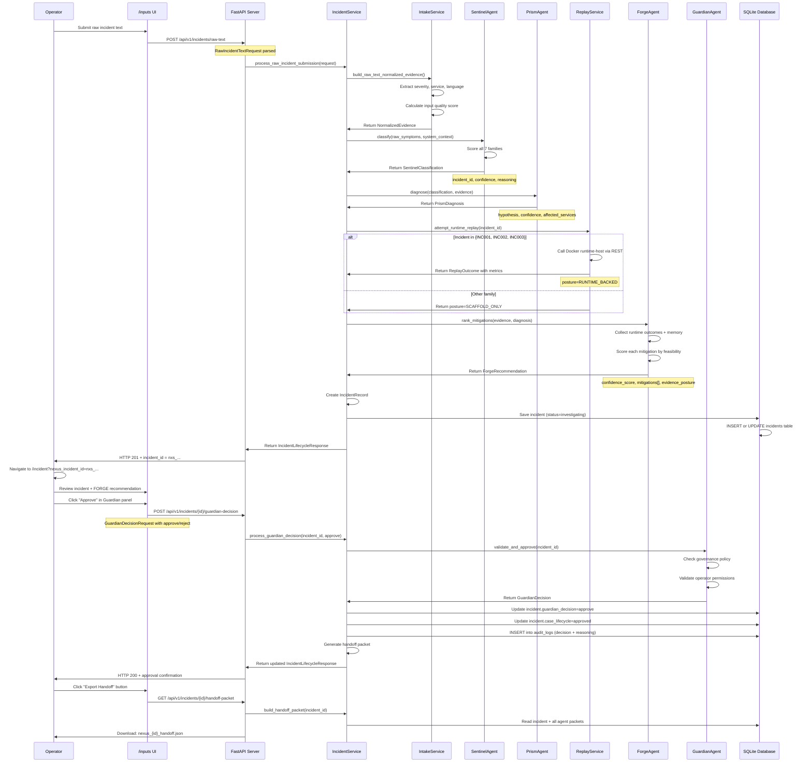
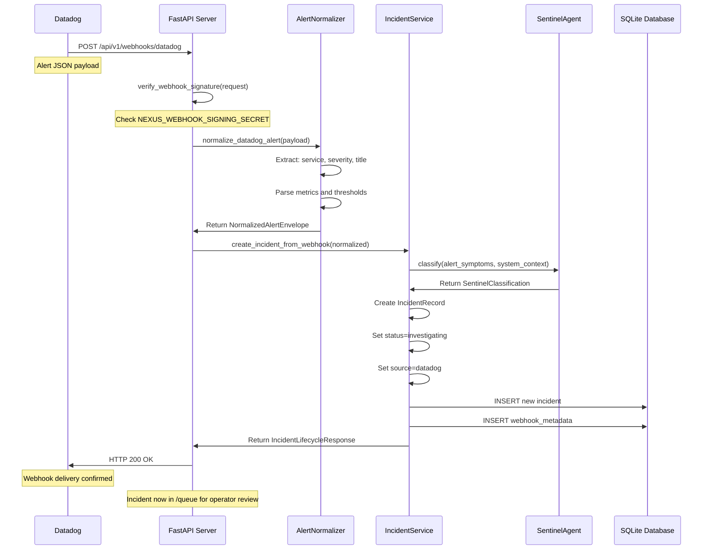
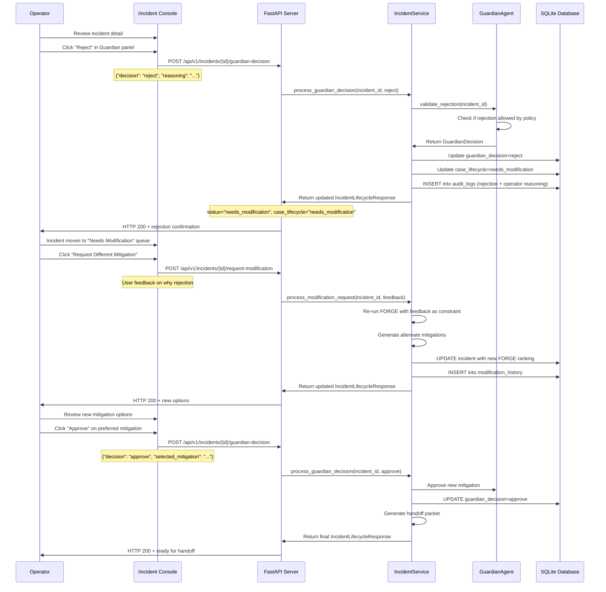
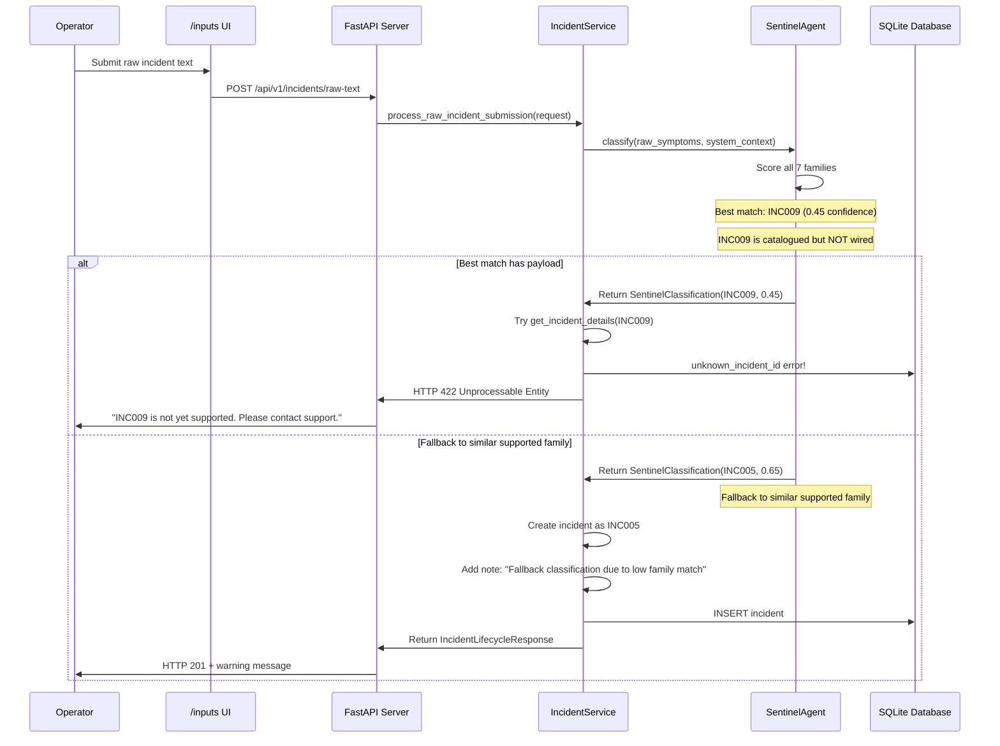
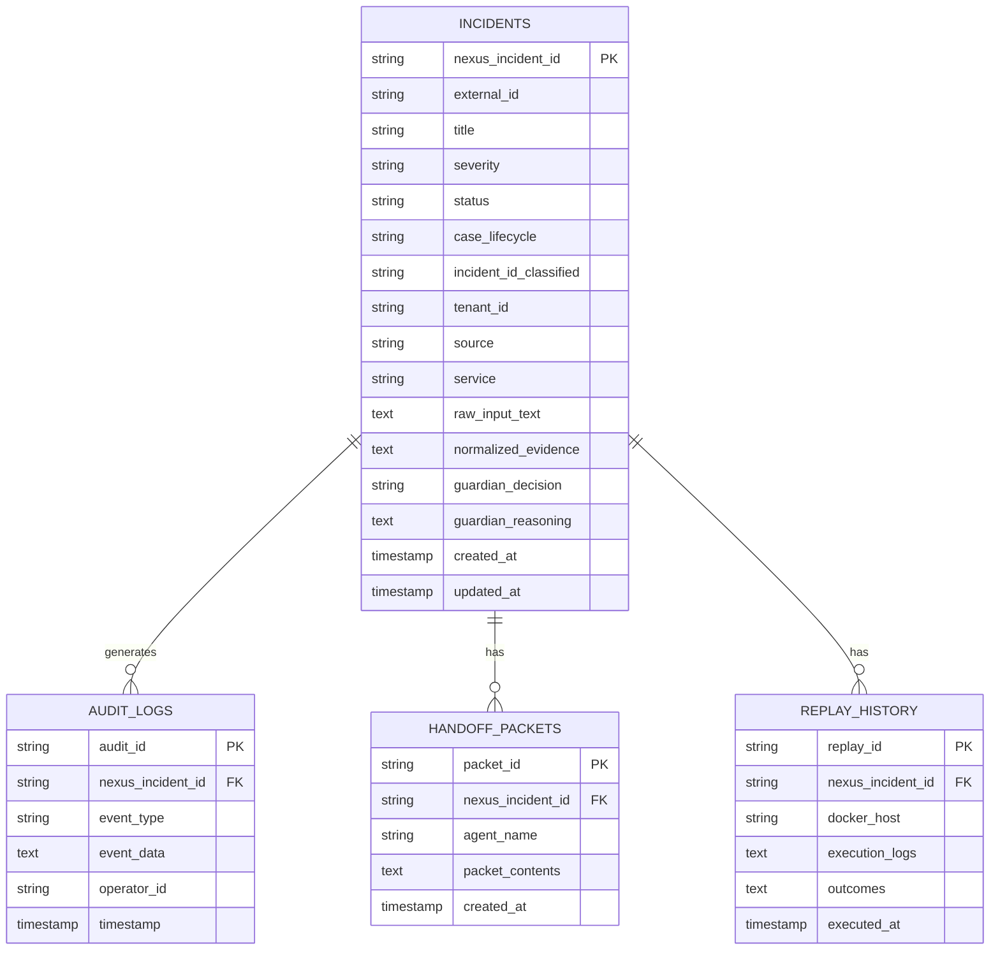

# Data Flow

End-to-end incident lifecycle from intake through Guardian decision and handoff.

## Fresh Raw-Text Submission Flow

Complete sequence from operator submitting text to Guardian approval.

## Webhook Ingestion Flow

Datadog or PagerDuty alert → NEXUS incident.

## Guardian Rejection and Retry Flow

Operator rejects recommendation, system asks for modification.

## Out-of-Scope Incident Handling

Operator submits incident that doesn't match any 7 supported families.

---

## Database Schema (Key Tables)

---

## Key Design Patterns

1. **Intake Normalization:** All input formats → `NormalizedEvidence` (deterministic, no LLM)
2. **Linear Handoff:** Each agent's output feeds next agent's input
3. **Durable Decisions:** All agent outputs + Guardian decision persisted to SQLite
4. **Explicit Rejection:** Out-of-scope incidents fail fast with clear error
5. **Modification Loop:** Operator can request alternate rankings without re-intake
6. **Audit Trail:** Every decision, rejection, and modification logged immutably
