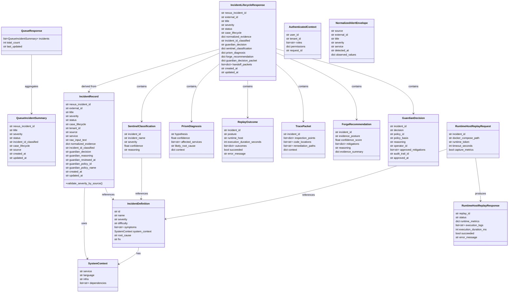

# Class Structure

Key data models and their relationships in the NEXUS system.

## Core Data Models



## Agent Output Models

Each agent produces a structured output that feeds into the incident record:

### SENTINEL Output: `SentinelClassification`

```python
@dataclass
class SentinelClassification:
    incident_id: str              # One of INC001-INC007
    incident_name: str
    severity: str                 # P0-P4
    confidence: float             # 0.0-1.0
    reasoning: str
```

**Used by:** PRISM, REPLICA, TRACE, FORGE  
**Stored in:** `IncidentRecord.incident_id_classified`

---

### PRISM Output: `PrismDiagnosis`

```python
@dataclass
class PrismDiagnosis:
    hypothesis: str               # Root cause hypothesis
    confidence: float             # 0.0-1.0
    affected_services: list[str]
    likely_root_cause: str
    context: dict                 # Evidence used in diagnosis
```

**Used by:** REPLICA, TRACE, FORGE  
**Stored in:** `IncidentLifecycleResponse.prism_diagnosis`

---

### REPLICA Output: `ReplayOutcome`

```python
@dataclass
class ReplayOutcome:
    incident_id: str
    posture: str                  # RUNTIME_BACKED or SCAFFOLD_ONLY
    runtime_host: str             # Docker host URL (if ran)
    execution_duration_seconds: int
    outcomes: list[dict]          # Runtime metrics before/after
    succeeded: bool
    error_message: str | None
```

**Evidence Posture:**
- `RUNTIME_BACKED` — Incident reproduced successfully
- `SCAFFOLD_ONLY` — Not in runtime-backed set (INC001-INC003)

**Stored in:** `IncidentLifecycleResponse.replay_outcome`

---

### TRACE Output: `TracePacket`

```python
@dataclass
class TracePacket:
    incident_id: str
    inspection_points: list[dict]  # {file, line, context}
    code_locations: list[str]      # File:line pairs
    remediation_paths: list[str]
    context: dict                  # Evidence used for inspection
```

**Stored in:** `IncidentLifecycleResponse.trace_packet`

---

### FORGE Output: `ForgeRecommendation`

```python
@dataclass
class ForgeRecommendation:
    incident_id: str
    evidence_posture: str          # RUNTIME_BACKED, INFERENCE_FIRST, etc.
    confidence_score: float        # 0.0-1.0
    mitigations: list[dict]        # Ranked by feasibility
    reasoning: str
    evidence_summary: dict         # Which evidence informed ranking
```

**Mitigation Structure:**
```python
{
    "action": "drain hot pods",
    "risk_level": "low",
    "impact": "immediate",
    "confidence": 0.95,
    "reasoning": "Runtime outcomes show CPU saturation..."
}
```

**Stored in:** `IncidentLifecycleResponse.forge_recommendation`

---

### GUARDIAN Output: `GuardianDecision`

```python
@dataclass
class GuardianDecision:
    incident_id: str
    decision: str                  # approve, reject, or request_modification
    policy_id: str
    policy_basis: str
    reasoning: str
    operator_id: str
    approved_mitigations: list[str]
    audit_trail_id: str
    approved_at: str
```

**Stored in:** `IncidentRecord.guardian_decision` + audit log

---

## Request/Response Models

### `/api/v1/incidents/raw-text`

**Request:** `RawIncidentTextRequest`
```python
{
    "title": str,
    "raw_logs": str,
    "service": str | None,
    "severity": str | None
}
```

**Response:** `IncidentLifecycleResponse`

---

### `/api/v1/incidents/{id}/guardian-decision`

**Request:** `GuardianDecisionRequest`
```python
{
    "decision": "approve" | "reject" | "request_modification",
    "reasoning": str,
    "selected_mitigation": str | None
}
```

**Response:** `IncidentLifecycleResponse`

---

### `/api/v1/incidents`

**Response:** `QueueResponse`
```python
{
    "incidents": [QueueIncidentSummary, ...],
    "total_count": int,
    "last_updated": str
}
```

---

## Type Definitions

### Enums

**Status:**
```
investigating | resolved | blocked_by_guardian | needs_modification
```

**Case Lifecycle:**
```
created | triaged | investigating | handoff_prepared | awaiting_review | approved | executed | closed
```

**Guardian Decision:**
```
pending | approve | reject | request_modification
```

**Evidence Posture:**
```
RUNTIME_BACKED | INFERENCE_FIRST | SCAFFOLD_ONLY | UNSUPPORTED
```

**Source:**
```
datadog | prometheus | webhook | raw_text | manual_form | slack_command | stream_anomaly | batch_import
```

---

## Storage Mapping

How these models map to database tables:

| Class | Primary Table | Audit Table |
|---|---|---|
| `IncidentRecord` | `incidents` | `audit_logs` |
| `SentinelClassification` | incidents.incident_id_classified | audit_logs |
| `PrismDiagnosis` | incidents.normalized_evidence (JSON) | audit_logs |
| `ReplayOutcome` | replay_history | audit_logs |
| `GuardianDecision` | incidents.guardian_decision | audit_logs |

All decision history is **immutable** once written to `audit_logs`.

---

## Design Patterns

1. **Pydantic Models:** All classes inherit from `BaseModel` for validation
2. **Immutable Audit Trail:** Decisions logged before updating primary records
3. **Tenant Isolation:** All models include `tenant_id` for multi-tenant support
4. **Nullable Timestamps:** Lifecycle events timestamped only when they occur
5. **Flat Dicts:** Nested data stored as JSON in `normalized_evidence` (no deep nesting)
