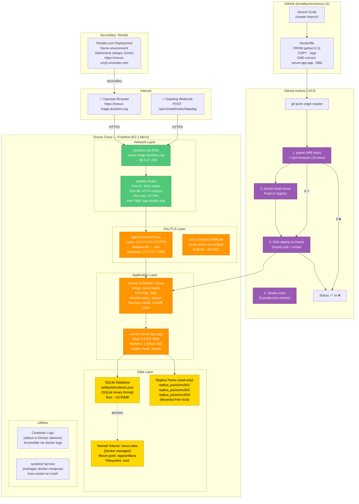
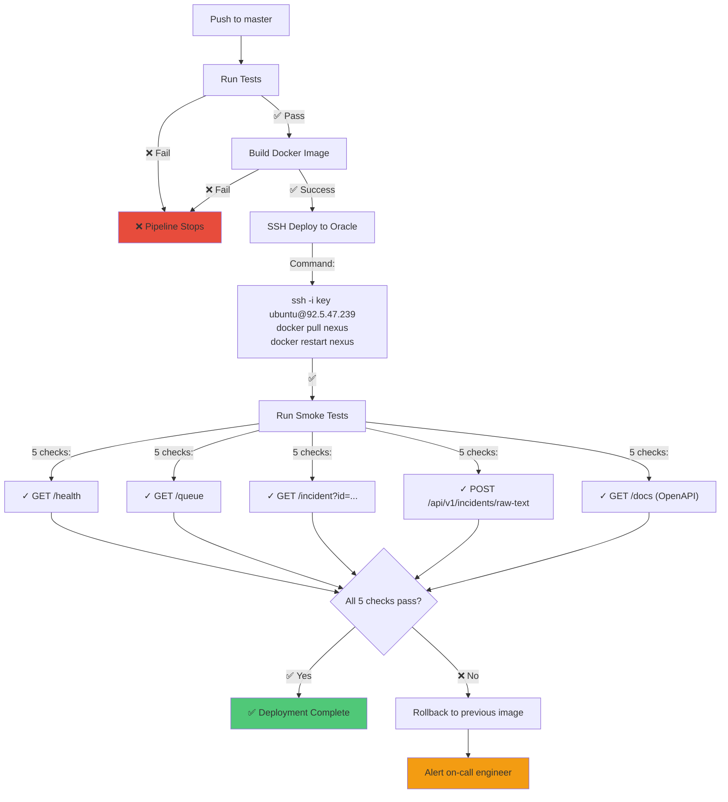
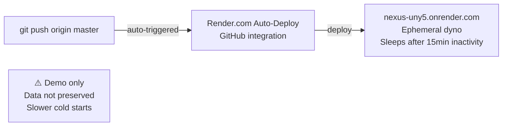

# Deployment Architecture

Oracle Cloud VM setup, Docker containerization, and CI/CD pipeline.

## Production Deployment (Oracle Cloud)



## Infrastructure Details

### Oracle Cloud VM Specs

| Property | Value |
|----------|-------|
| **Compute Shape** | VM.Standard.E2.1.Micro |
| **vCPUs** | 1 (burstable) |
| **Memory** | 1 GB RAM |
| **Storage** | 50 GB (root volume) |
| **Region** | Frankfurt (eu-frankfurt-1) |
| **OS** | Ubuntu 22.04 LTS |
| **Public IP** | 92.5.47.239 |
| **SSH Key** | ~/Downloads/ssh-key-2026-06-19.key |
| **Cost** | Always-free tier (~$0/month) |

### SSH Access

```bash
ssh -i ~/Downloads/ssh-key-2026-06-19.key ubuntu@92.5.47.239

# Common tasks:
docker ps                                    # List containers
docker logs nexus -f                        # Follow app logs
docker exec -it nexus /bin/bash            # Shell into container
sudo systemctl status nexus                # Systemd service status
sudo systemctl restart nexus               # Restart service
```

### Docker Setup

**docker-compose.yml** structure:
```yaml
version: '3.9'
services:
  nexus:
    image: nexus:latest
    container_name: nexus
    restart: always
    ports:
      - "7860:7860"  # Exposed to localhost only initially
    volumes:
      - nexus-data:/app/artifacts
      - /path/to/replica_packs:/app/replica_packs:ro
    environment:
      - APP_ENV=production
      - NEXUS_DATABASE_PATH=/app/artifacts/incidents.json
      - NEXUS_ALLOWED_TENANT_IDS=tenant-a,tenant-system
      - NEXUS_FORGE_MODEL_NAME=gpt-4o
      - NEXUS_USE_OPENAI=0
    healthcheck:
      test: ["CMD", "curl", "-f", "http://localhost:7860/health"]
      interval: 30s
      timeout: 10s
      retries: 3

volumes:
  nexus-data:
    driver: local
```

### Network Configuration

**nginx config:**
```nginx
server {
    listen 80;
    server_name nexus-triage.duckdns.org;
    return 301 https://$server_name$request_uri;
}

server {
    listen 443 ssl http2;
    server_name nexus-triage.duckdns.org;
    
    ssl_certificate /etc/letsencrypt/live/nexus-triage.duckdns.org/fullchain.pem;
    ssl_certificate_key /etc/letsencrypt/live/nexus-triage.duckdns.org/privkey.pem;
    ssl_protocols TLSv1.2 TLSv1.3;
    ssl_ciphers HIGH:!aNULL:!MD5;
    
    location / {
        proxy_pass http://127.0.0.1:7860;
        proxy_set_header Host $host;
        proxy_set_header X-Real-IP $remote_addr;
        proxy_set_header X-Forwarded-For $proxy_add_x_forwarded_for;
        proxy_set_header X-Forwarded-Proto $scheme;
    }
}
```

**iptables rules:**
```bash
# Allow SSH, HTTP, HTTPS
sudo iptables -I INPUT 1 -p tcp --dport 22 -j ACCEPT
sudo iptables -I INPUT 2 -p tcp --dport 80 -j ACCEPT
sudo iptables -I INPUT 3 -p tcp --dport 443 -j ACCEPT

# Restrict port 7860 to localhost only
sudo iptables -I INPUT -p tcp -s 127.0.0.1 --dport 7860 -j ACCEPT
sudo iptables -A INPUT -p tcp --dport 7860 -j DROP
```

### Data Persistence

**Named Volume (`nexus-data`):**
- Managed by Docker
- Location: `/var/lib/docker/volumes/nexus-data/_data`
- Contains: `incidents.json` (SQLite database)
- Survives container restarts
- Survives image updates

**Backup Strategy:**
```bash
# Backup
docker run --rm -v nexus-data:/data -v $(pwd):/backup alpine tar czf /backup/incidents-$(date +%Y%m%d).tar.gz /data

# Restore
tar xzf incidents-20260624.tar.gz -C /var/lib/docker/volumes/nexus-data/_data
docker restart nexus
```

## GitHub Actions CI/CD Pipeline



**Workflow File:** `.github/workflows/deploy.yml`

1. **Test Stage** (5 minutes)
   - `pytest tests/ --ignore=tests/test_production_gate3.py -q` → 495 passed
   - `npm run browser:verify` → 16 passed
   - Exit code 0 required to proceed

2. **Build Stage** (3 minutes)
   - `docker build -t nexus:latest .`
   - Push to registry (if applicable)

3. **Deploy Stage** (2 minutes)
   - SSH into Oracle Cloud VM
   - `docker pull nexus:latest`
   - `docker-compose restart nexus`
   - Wait for health check to pass

4. **Smoke Stage** (1 minute)
   - `bash scripts/test-live.sh https://nexus-triage.duckdns.org`
   - 5 endpoint checks must succeed
   - Exit code 0 = deployment succeeded

## Secondary Deployment: Render



---

## Health Checks

**Production Health:**
```bash
curl https://nexus-triage.duckdns.org/health
# Response: {"status": "ok"}

curl https://nexus-triage.duckdns.org/queue
# Response: {"incidents": [...], "total_count": 5, "last_updated": "2026-06-24T..."}
```

**Monitoring:**
- No monitoring system configured (manual checks via curl)
- Logs available via `docker logs nexus`
- Database accessible via `/app/artifacts/incidents.json`

---

## Common Operational Tasks

| Task | Command |
|------|---------|
| Restart app after code update | `docker-compose restart nexus` |
| View recent logs | `docker logs nexus -n 100` |
| Shell into running container | `docker exec -it nexus /bin/bash` |
| Backup database | `docker run --rm -v nexus-data:/data alpine tar cz /data > backup.tar.gz` |
| Check disk usage | `docker system df` |
| Prune old images | `docker image prune -a` |
| Check SSL cert expiry | `curl -v https://nexus-triage.duckdns.org 2>&1 \| grep expire` |
