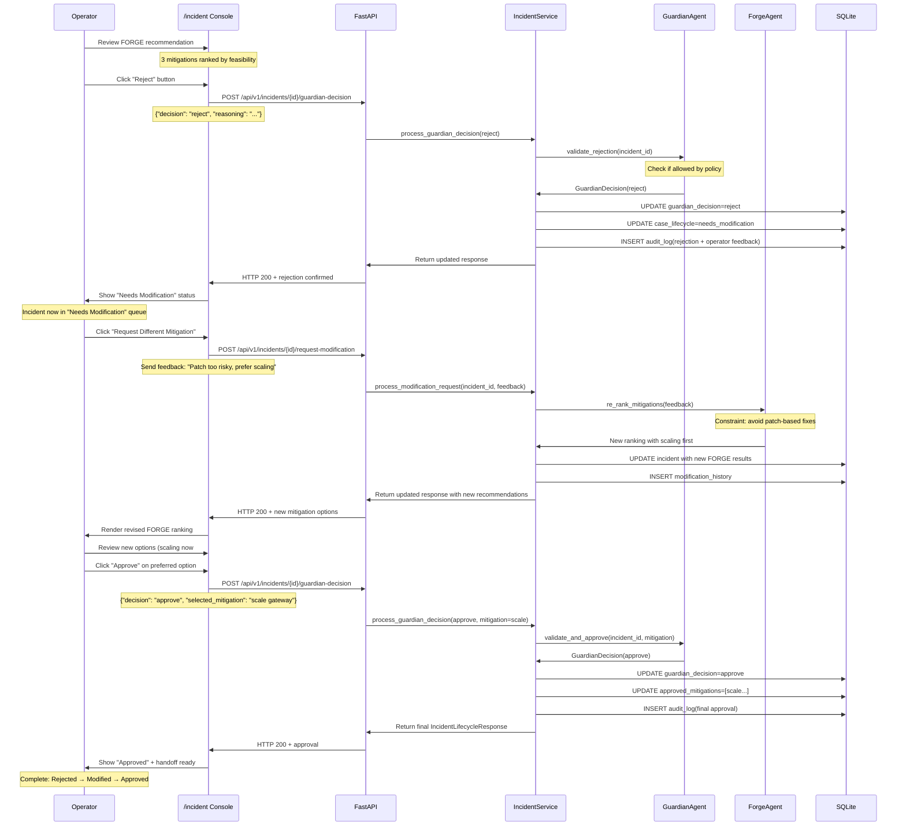
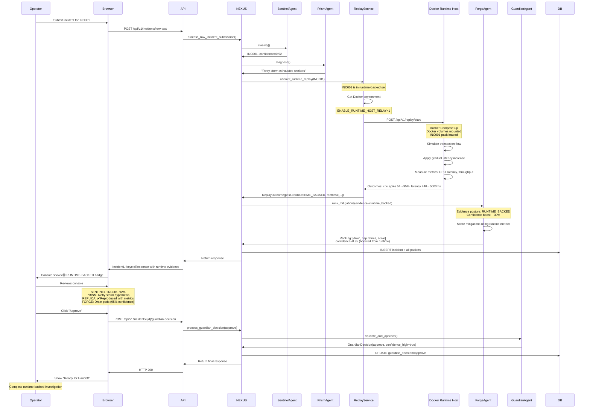
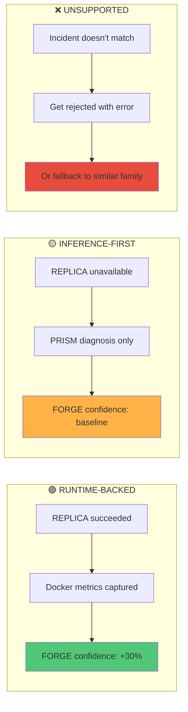

# Sequence Diagrams

Key user journeys and system interactions.

## Sequence 1: New Pilot Customer First Incident

Operator from pilot customer receives their first incident, submits it to NEXUS, and gets a Guardian-approved recommendation.

```mermaid
sequenceDiagram
    participant Operator
    participant Browser as Web Browser
    participant API as FastAPI Server
    participant NEXUS as IncidentService
    participant Agents as 6-Agent Pipeline
    participant DB as SQLite
    
    Operator->>Browser: Navigate to /inputs
    Browser->>API: GET /inputs
    API->>Browser: Render form
    
    Operator->>Browser: Paste raw logs
    Operator->>Browser: Enter service, severity
    Operator->>Browser: Click Submit
    
    Browser->>API: POST /api/v1/incidents/raw-text
    Note over API: RawIncidentTextRequest parsed
    
    API->>NEXUS: process_raw_incident_submission()
    
    NEXUS->>Agents: SENTINEL.classify()
    Note over Agents: Match symptoms vs 11 families, filter to 8 supported
    Agents->>NEXUS: INC001, confidence=0.87
    
    NEXUS->>Agents: PRISM.diagnose()
    Note over Agents: Generate hypothesis
    Agents->>NEXUS: "Retry storm on auth timeout"
    
    NEXUS->>Agents: REPLICA.attempt_replay()
    Note over Agents: Docker INC001 pack
    Agents->>NEXUS: Runtime metrics, posture=RUNTIME_BACKED
    
    NEXUS->>Agents: TRACE.inspect()
    Note over Agents: Code locations
    Agents->>NEXUS: Inspection points + remediation
    
    NEXUS->>Agents: FORGE.rank_mitigations()
    Note over Agents: Score by feasibility + impact
    Agents->>NEXUS: 3 ranked mitigations, confidence=0.92
    
    NEXUS->>DB: INSERT IncidentRecord(status=investigating)
    DB->>DB: Persist to artifacts/incidents.json
    
    NEXUS->>API: Return IncidentLifecycleResponse
    API->>Browser: HTTP 201 + nexus_incident_id
    
    Note over Operator: Incident created; now reviewing
    
    Operator->>Browser: Click incident from queue
    Browser->>API: GET /incident?nexus_incident_id=nxs_...
    API->>NEXUS: load_incident(incident_id)
    NEXUS->>DB: Read from SQLite
    API->>Browser: Full IncidentLifecycleResponse
    Browser->>Operator: Render incident console
    
    Note over Operator: Reviews all agent packets:<br/>Classification, Diagnosis, Replay,<br/>Inspection Points, Recommendations
    
    Operator->>Browser: Click "Approve" in Guardian panel
    Browser->>API: POST /api/v1/incidents/{id}/guardian-decision
    Note over Browser: {"decision": "approve", "reasoning": "..."}
    
    API->>NEXUS: process_guardian_decision(approve)
    NEXUS->>Agents: GUARDIAN.validate()
    Note over Agents: Check policy, record decision
    Agents->>NEXUS: GuardianDecision(approve)
    
    NEXUS->>DB: UPDATE incident.guardian_decision=approve
    NEXUS->>DB: INSERT audit_log(decision + reasoning)
    NEXUS->>API: Return updated IncidentLifecycleResponse
    
    API->>Browser: HTTP 200 + approval confirmation
    Browser->>Operator: Show "Approved" badge
    
    Operator->>Browser: Click "Export Handoff"
    Browser->>API: GET /api/v1/incidents/{id}/handoff-packet
    API->>NEXUS: build_handoff_packet(incident_id)
    NEXUS->>DB: Read incident + all packets
    API->>Browser: Download nexus_{id}_handoff.json
    
    Note over Operator: Handoff ready for engineering<br/>Complete workflow in 5 minutes
```

---

## Sequence 2: Webhook-Triggered Incident (Datadog)

Datadog fires an alert → NEXUS ingests → Operator reviews in queue.

```mermaid
sequenceDiagram
    participant Datadog
    participant API as FastAPI Webhook
    participant NEXUS as IncidentService
    participant SENTINEL as SentinelAgent
    participant DB as SQLite
    participant Operator
    participant Browser
    
    Datadog->>API: POST /api/v1/webhooks/datadog
    Note over Datadog: Alert JSON: CPU>90%, service=api-gateway
    
    API->>API: verify_webhook_signature(request)
    Note over API: Check NEXUS_WEBHOOK_SIGNING_SECRET
    
    API->>API: AlertNormalizer.normalize(payload)
    Note over API: Extract service, severity, metrics
    
    API->>NEXUS: create_incident_from_webhook(normalized)
    
    NEXUS->>SENTINEL: classify(alert_symptoms, context)
    Note over SENTINEL: Best match: INC001 (API Timeout)
    SENTINEL->>NEXUS: SentinelClassification(INC001, 0.89)
    
    NEXUS->>NEXUS: Create IncidentRecord
    Note over NEXUS: status=investigating<br/>source=datadog<br/>incident_id=INC001
    
    NEXUS->>DB: INSERT new incident
    NEXUS->>DB: INSERT webhook_metadata
    
    NEXUS->>API: Return IncidentLifecycleResponse
    API->>Datadog: HTTP 200 OK
    Note over Datadog: Webhook delivery confirmed
    
    Note over Operator: Webhook ingested; incident now in queue
    
    Operator->>Browser: Refresh /queue
    Browser->>API: GET /api/v1/incidents
    API->>NEXUS: list_incidents()
    NEXUS->>DB: SELECT * FROM incidents ORDER BY created_at DESC
    API->>Browser: QueueResponse with new webhook incident
    
    Browser->>Operator: Incident appears at top of queue
    Note over Browser: Title from Datadog, severity P1
    
    Operator->>Browser: Click to open incident detail
    Browser->>API: GET /incident?nexus_incident_id=nxs_...
    API->>Browser: Full incident lifecycle response
    Browser->>Operator: Render console (but GUARDIAN pending)
    
    Note over Operator: System has classified but not<br/>approved/executed yet
```

---

## Sequence 3: Guardian Rejection and Retry

Operator rejects recommendation, system asks for modification.



---

## Sequence 4: Out-of-Scope Incident

Operator submits incident that doesn't match any supported family.

```mermaid
sequenceDiagram
    participant Operator
    participant Browser as /inputs UI
    participant API as FastAPI
    participant NEXUS as IncidentService
    participant SENTINEL as SentinelAgent
    participant DB as SQLite
    
    Operator->>Browser: Submit raw logs for obscure issue
    Browser->>API: POST /api/v1/incidents/raw-text
    Note over API: Symptoms don't match INC001-INC007
    
    API->>NEXUS: process_raw_incident_submission()
    
    NEXUS->>SENTINEL: classify(symptoms, context)
    SENTINEL->>SENTINEL: Score all 11 families in catalogue
    Note over SENTINEL: Best match: INC004 (Load Balancer)<br/>Confidence: 0.35
    SENTINEL->>NEXUS: SentinelClassification(INC004, 0.35)
    
    NEXUS->>NEXUS: Try get_incident_details(INC004)
    Note over NEXUS: INC004 not in incident_payloads!<br/>ValueError: unknown_incident_id
    
    alt INC004 is catalogued but not wired
        NEXUS->>API: HTTP 422 Unprocessable Entity
        API->>Browser: Error response
        Browser->>Operator: Message: "INC004 not yet supported.<br/>Please contact support."
    else Try fallback to similar family
        NEXUS->>SENTINEL: try_fallback(best_unsupported=INC004)
        SENTINEL->>SENTINEL: Find highest-confidence supported family<br/>Second best: INC005 (Queue Backlog)<br/>Confidence: 0.28
        SENTINEL->>NEXUS: SentinelClassification(INC005, 0.28, fallback=true)
        
        NEXUS->>NEXUS: Create IncidentRecord
        Note over NEXUS: incident_id=INC005<br/>classification_confidence=0.28<br/>fallback_note: "Out-of-scope; classified as INC005"
        
        NEXUS->>DB: INSERT incident
        NEXUS->>API: Return IncidentLifecycleResponse
        API->>Browser: HTTP 201 + warning
        Browser->>Operator: Message: "Low confidence match.<br/>This may not be INC005.<br/>Consider reaching out to engineering."
        
        Note over Operator: Incident created but flagged as uncertain
    end
```

---

## Sequence 5: Incident with Runtime-Backed Evidence

Complete flow showing REPLICA achieving runtime reproduction.



---

## Comparison: Evidence Postures



---

## Summary: When Each Posture Occurs

| Posture | When | Examples | Confidence |
|---------|------|----------|-----------|
| 🟢 Runtime-backed | INC001, INC002, INC003 classified + Docker relay enabled | Timeout cascade, pool exhaustion | 90-95% |
| 🟡 Inference-first | INC004-INC007 classified, or docker relay disabled | Cache explosion, queue backlog, auth slowdown | 65-85% |
| ❌ Unsupported | INC008-INC011 best match | CDN, ML model, geographic routing | Rejected or fallback |
