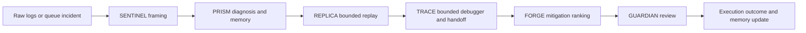

# NEXUS Visual Architecture And Flows

Current as of 2026-06-16.

## Product Screenshots

### Command Center

### Incident Detail

### Raw Log To Incident Flow

### Learning & Controls

## What The Product Must Answer

Every major surface should help the operator answer:

1. what is most likely happening?
2. who likely owns it?
3. what prior cases matter?
4. what is supported versus bounded?
5. what should happen next?
6. who approves the action?

## Strongest Review Flow

The strongest truthful UI path is:

`/queue -> seeded incident -> Inspect intake -> /inputs -> fresh nxs incident -> /training -> /settings`

## Current Workflow

This is the shipped bounded workflow.

## Bounded Coverage

The current wedge covers five bounded outage families:

- timeout / retry amplification
- DB pool exhaustion / session leak
- deploy regression / 5xx spike
- queue / worker backlog
- auth dependency slowdown / token validation failures

REPLICA and TRACE are real for curated families, but they remain bounded and explicit.

Every stakeholder walkthrough should also keep the support posture explicit:

- `runtime-backed`
- `inference-first`
- `unsupported`
